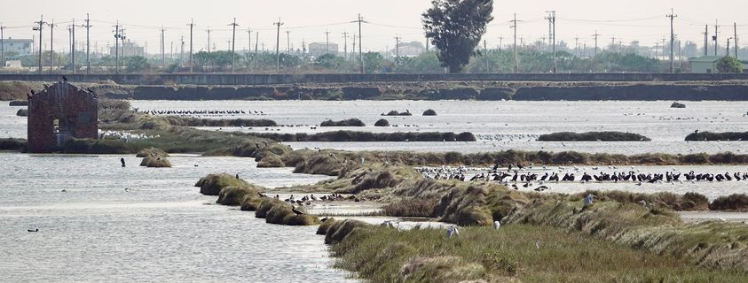

# 鳥仔 ê 名 - 認捌鳥仔 ê 台語

為著予大家認捌鳥仔 ê 台語，我整理了這個清單，予大家方便揣鳥仔 ê 台語名，希望會當藉著認捌鳥仔 ê 名，嘛有越來越濟人使用這个漸漸消失 ê 語言。

Uī-tio̍h hōo ta-ke jīn-bat tsiáu-á ê Tâi-gí. Guá tsíng-lí tsit-ê tshing-tuann, hōo ta-ke hong-piān tshuē tsiáu-á ê Tâi-gí miâ. Hi-bōng ē-tàng tsioh-tioh jīn-bat tsiáu-á ê miâ, mā-ū lú-lâi-lú tsuē lâng sú-iōng tsit-ê tsiām-tsiām siau-sit ê gí-giân.

:::info[是按怎欲創作《鳥仔 ê 名 - 認捌鳥仔 ê 台語》？]

- 誠濟鳥仔 ê 台語名，猶原停留佇日本時代，無綴著上新 ê 鳥仔分類。仝款一个台語俗名，以前可能干焦知影一種物種，但是因為研究 ê 進步，這馬知影毋但一个物種，煞無法度用台語使用 kah 討論。
- 若是以前無佇台灣生活 ê 鳥仔，可能也無台語名。
- 因為市面上 ê 鳥仔圖鑑主要攏是使用華語，目前是揣無用台語寫成 ê 鳥仔圖鑑。《鳥仔 ê 名 - 認捌鳥仔 ê 台語》內底包含誠濟台語新詞的創作，目的是鼓勵咱去揣看覓敢有較適合鳥仔物種的台語名，以期待未來會當有一本台語為主 ê 鳥仔圖鑑。

你若有發現寫毋著 ê 所在抑是建議 ê 名，請佇下跤留話抑是寫電子批共我講，我會趁有閒的時陣來改，請手梳攑懸，多謝！

🚀 你若有興趣做伙合作，也請佇下跤留話抑是寫電子批共我講。

- ✉️ 電子批: [minsiansu@gmail.com](mailto:minsiansu@gmail.com)
- 📸 相片冊: [siansiansu](https://www.instagram.com/siansiansu/)

:::

## 重要 ê 參考

- 📕 上新的分類參考 [eBird](https://ebird.org/home) 佮[eBird Taiwan鳥類名錄 2024.10 (製表：eBird Taiwan))](https://docs.google.com/spreadsheets/d/1PnZ2V8jMjw9MvGLlXNs05gSz43sigs-tewDdx19YebA/edit?usp=sharing)。
- 📕 台語俗名參考 [蕭平治 | 還我台灣鳥 á 名](https://siaulahjih.github.io/TaiOanChiauA/) kah [台灣野鳥鄉土名](https://www.oocities.org/~smewmao/taiwan/twnname.html)。
- 📕 華語俗名參考 [eBird](https://ebird.org/home) 佮[台灣生物多樣性網絡](https://www.tbn.org.tw/)。
- 📕 台語字參考 [ChhoeTaigi 台語辭典](https://chhoe.taigi.info/)佮[教育部臺灣閩南語常用詞辭典](https://sutian.moe.edu.tw/)。
- 📕 鳥仔的外觀參考 [The Sibley Field Guide by David Allen Sibley](https://www.audubon.org/marketplace/sibley-field-guides)。
- 📕 鳥仔冊參考[台灣野鳥手繪圖鑑](https://www.books.com.tw/products/0010918403)(二版)。
- 📕 鳥仔圖使用 [iNaturalist](https://www.inaturalist.org/) 面頂 ê `CC0`、`CC-BY`、`CC-BY-NC` 授權。

## 📖 鳥仔名 ê 註解

### 📎 詞源

- [台]：依據台灣本土的台語俗稱。
- [日]：外來語，依據日本名。
- [英]：外來語，依據英文名。
- [華]：外來語，依據台灣使用的華語名。
- [中]：外來語，依據中國使用的華語名。

### 🎏 特有亞種

- [台亞]：台灣亞種。
- [日亞]：日本亞種。

### 🐦 其他註記

- 🎯：推薦做為這个唯一物種的台語俗名。
- ✳️：統稱，有兩個以上的物種攏會使叫這个名。

## 號名邏輯

- 若是有台灣本土 ê 台語俗稱，代先使用。
- 若是台灣本土 ê 台語俗稱是統稱，但是毋但一个物種，參考英語、日語、華語 ê 用法，頭前加上形容詞。

:::info[範例一：下跤 ê 物種攏是講青笛仔]

   1. 斯氏繡眼 Swinhoe's White-eye (學名：*Zosterops simplex*)
   2. 日菲繡眼 Warbling White-eye (學名：*Zosterops japonicus*)
   3. 低地繡眼 Lowland White-eye (學名：*Zosterops meyeni*)
   4. 紅脇繡眼 Chestnut-flanked White-eye (學名：*Zosterops erythropleurus*)

:::

建議頭前加上形容詞 + 台灣本土台語稱呼區分：

:::tip[建議台語名]

  1. 斯氏青笛仔 su-sī-tshenn-thî-á
  2. 日菲青笛仔 ji̍t-hui-tshenn-thî-á
  3. 低地青笛仔 kē-tē-tshenn-thî-á
  4. 赤胳青笛仔 tshiah-koh-tshenn-thî-á

:::

:::info[範例二：下跤 ê 物種攏是水避仔 ê 一種]

1. 小鸊鷉 Little Grebe (學名：*Tachybaptus ruficollis*)
2. 角鸊鷉 Horned Grebe (學名：*Podiceps auritus*)
3. 赤頸鸊鷉 Red-necked Grebe (學名：*Podiceps grisegena*)
4. 冠鸊鷉 Great Crested Grebe (學名：*Podiceps cristatus*)
5. 黑頸鸊鷉 Eared Grebe (學名：*Podiceps nigricollis*)

:::

:::tip[建議台語名]

1. 水避仔 tsuí-pī-á
2. 角水避 kak-tsuí-pī
3. 紅頸水避 âng-kún-tsuí-pī
4. 聳毛水避 kuan-tsuí-pī
5. 烏頸水避 oo-kún-tsuí-pī

:::

- 若揣無台灣本土 ê 台語俗名，參考華語俗名、英語俗名、日語俗名、鳥仔 ê 形體外觀、色水命名。譬如：

:::info[範例三：以下物種無台語俗名]

- 鐵嘴鴴 Greater Sand-Plover (學名：*Anarhynchus leschenaultii*)
- 赤腹鶇 Brown-headed Thrush (學名：*Turdus chrysolaus*)
- 堪察加柳鶯 Kamchatka Leaf Warbler (學名：*Phylloscopus examinandus*)

:::

:::tip[建議台語名]

- 鐵嘴鴴 ê 台語：厚喙鴴 kāu-tshuì-hîng
- 赤腹鶇 ê 台語：紅腹鶇 âng-pak-tong
- 堪察加柳鶯 ê 台語：堪察加柳鶯 kham-tshâ-tsham-liú-ing

:::

:::info[範例四：若無台語名，無一定愛參考華語]

- 華語「褐翅鴉鵑」是參考伊 ê 英語名「Greater Coucal」+ 華語「番鵑」 ê 台語號名。
- 華語「斑背潛鴨」是參考伊 ê 日語名。

:::

:::tip[建議台語名]

- 褐翅鴉鵑 ê 台語：大草嘓 tuā-tsháu-kok。
- 斑背潛鴨 ê 台語：鈴鴨 lîng-ah。

:::

:::info[範例五：分類名盡量用台灣本土 ê 台語號名]

為著較合台語 ê 氣口。

- 華語夜鷹目 -> 石磯仔目 tsio̍h-ki-á-ba̍k
- 華語鸊鷉科 -> 水避仔科 tsuí-pī-á-koa
- 華語秧雞科 -> 米雞仔科 bí-ke-á-koa
- 華語水雉科 -> 菱角鳥科 lîng-kak-niû-koa

:::
