# 鳥仔 ê 身體部位（圖）

用圖介紹鳥仔 ê 身體部位，圖來自 [The Sibley Field Guide by David Allen Sibley](https://www.audubon.org/marketplace/sibley-field-guides)，翻譯來自[鳥仔身體部位 ê 台語](./anatomy.md)，大部分 ê 名目前無正式 ê 台語稱呼，我盡量依據其他語言翻譯，你若感覺有較好 ê 稱呼請 kā 我講。

- ✉️ 電子批: [minsiansu@gmail.com](mailto:minsiansu@gmail.com)
- 📸 相片冊: [siansiansu](https://www.instagram.com/siansiansu/)

## 雀 tshiok

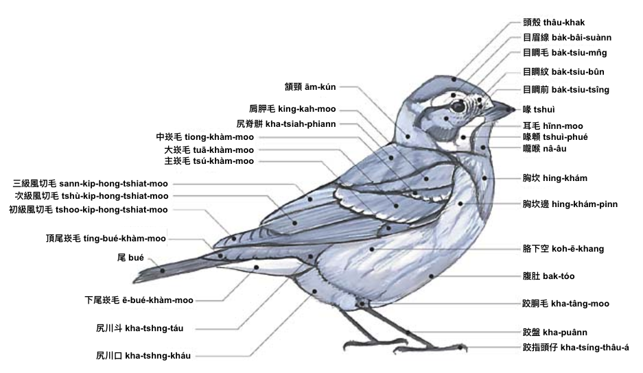

---

## 頭 thâu

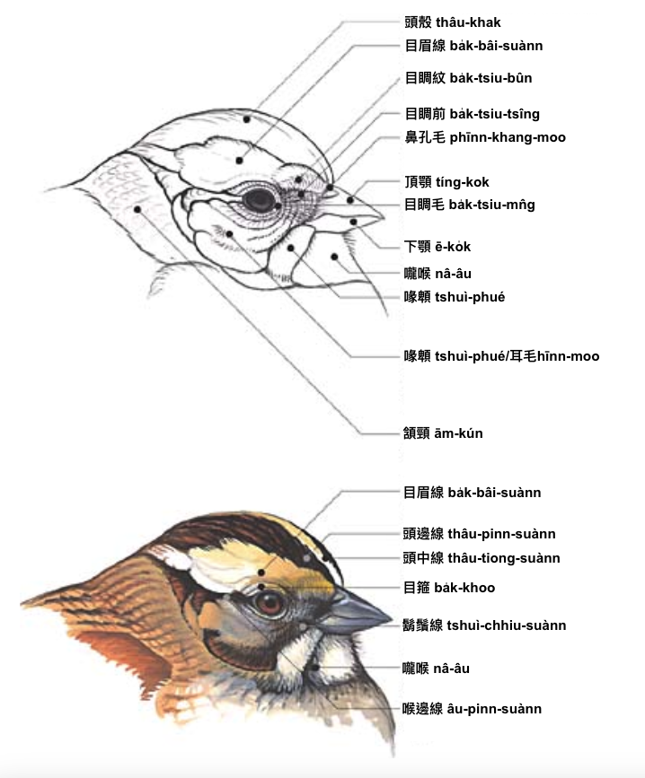

---

## 身軀 sin-khu

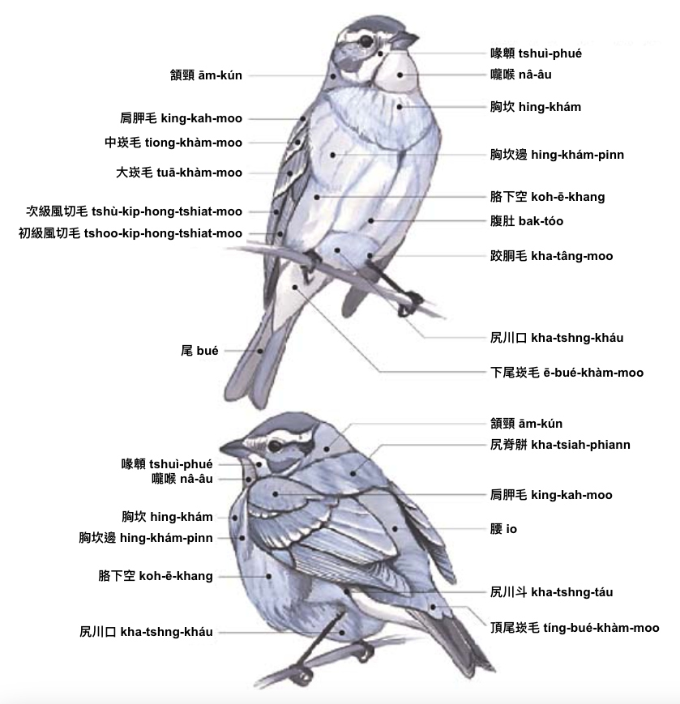

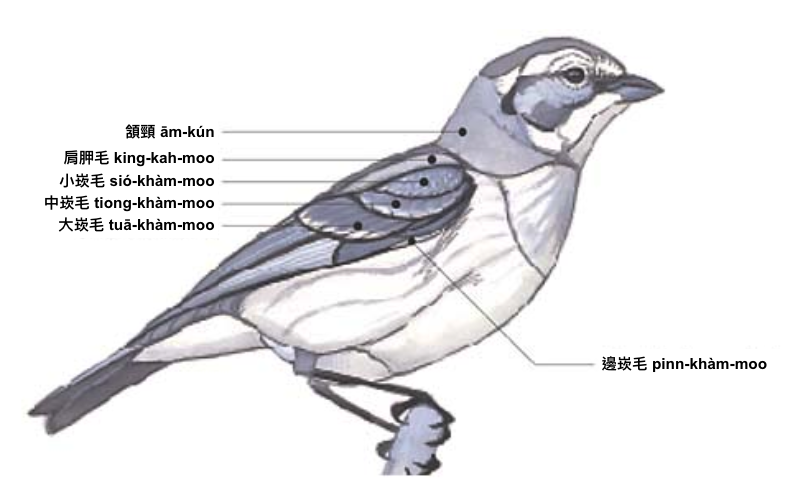

---

## 翼 si̍t

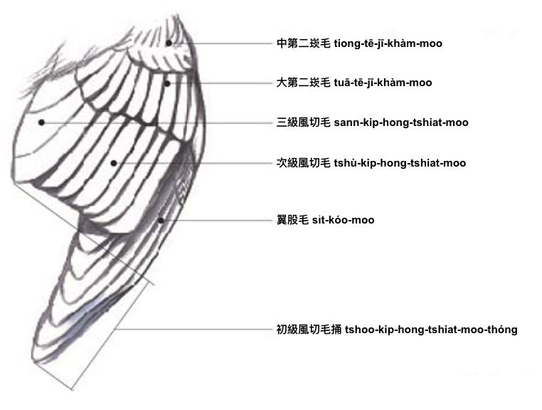

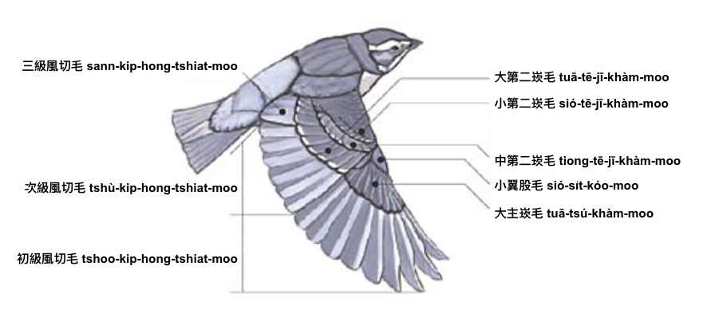

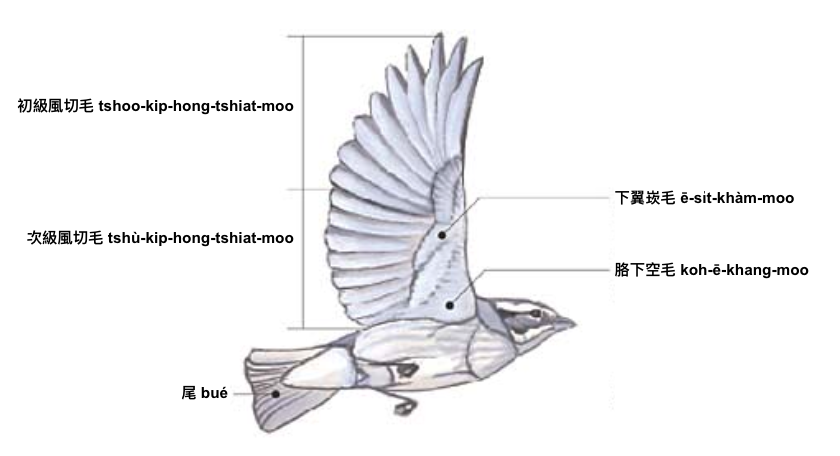

---

## 鷸鴴 lu̍t-hîng

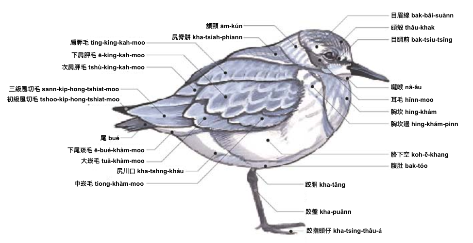

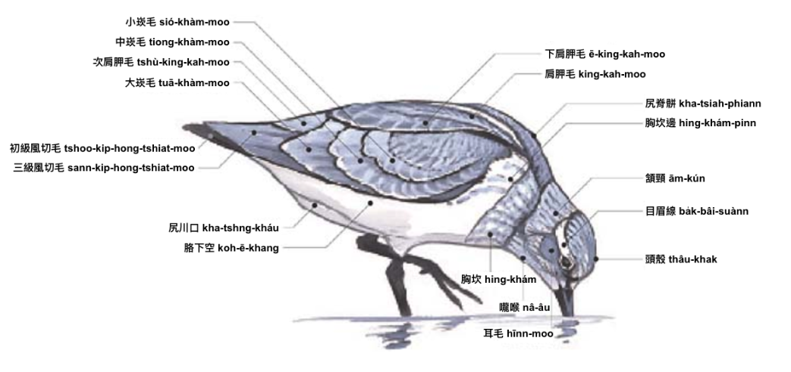

---

## 鴨 ah

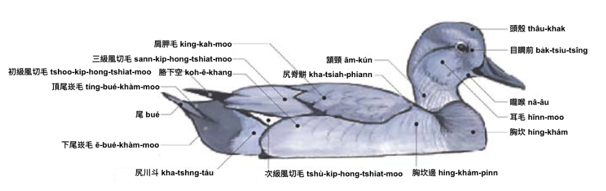

---

## 鷗 oo

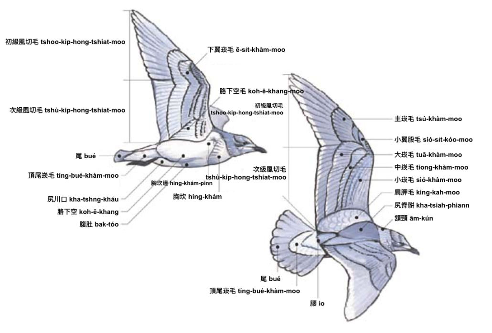

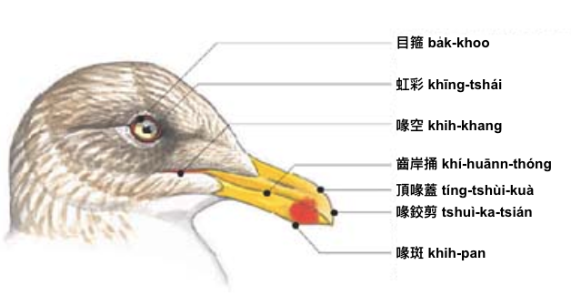
