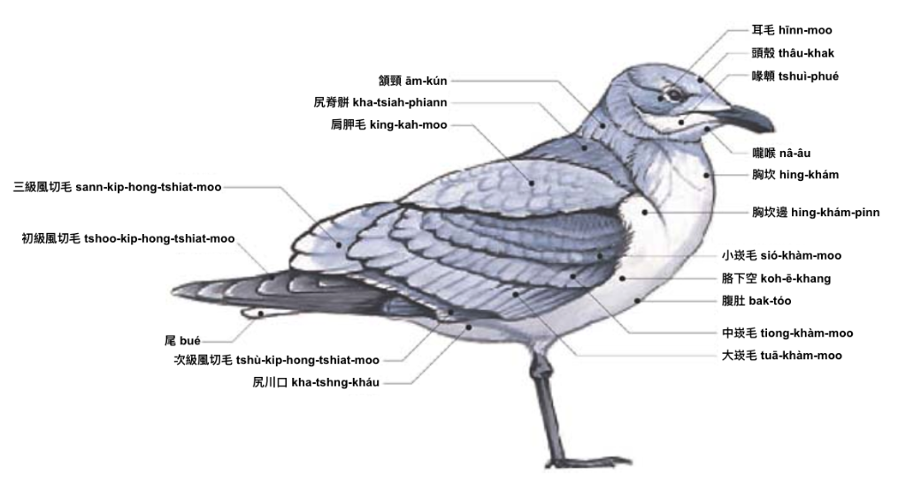

# 鳥仔 ê 身體部位（圖）

用圖介紹鳥仔 ê 身體部位，圖來自 [The Sibley Field Guide by David Allen Sibley](https://www.audubon.org/marketplace/sibley-field-guides)，翻譯來自[鳥仔身體部位 ê 台](./anatomy.md)。

## 雀 tshiok

---

## 頭 thâu

---

## 身軀 sin-khu

---

## 翼 si̍t

---

## 鷸鴴 u̍t-hîng

---

## 鴨 ah

---

## 鷗 oo

