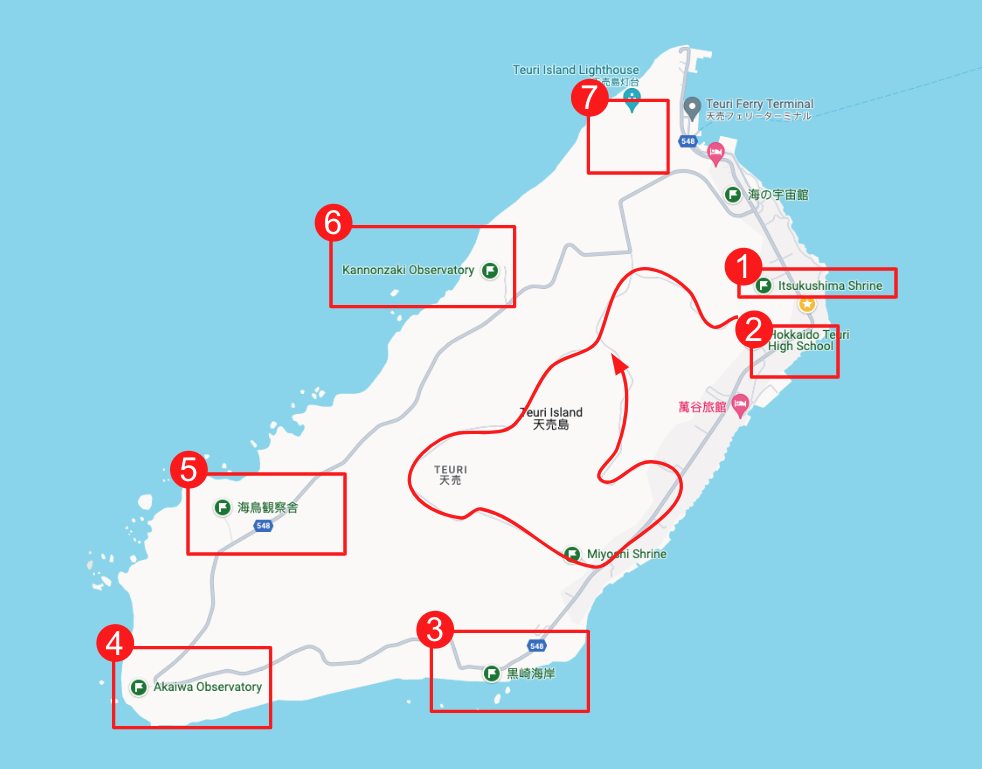
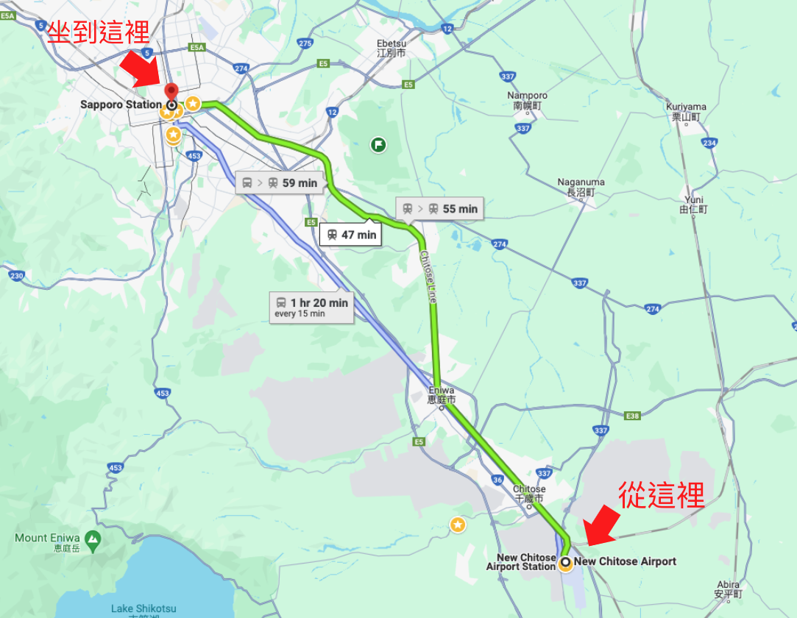
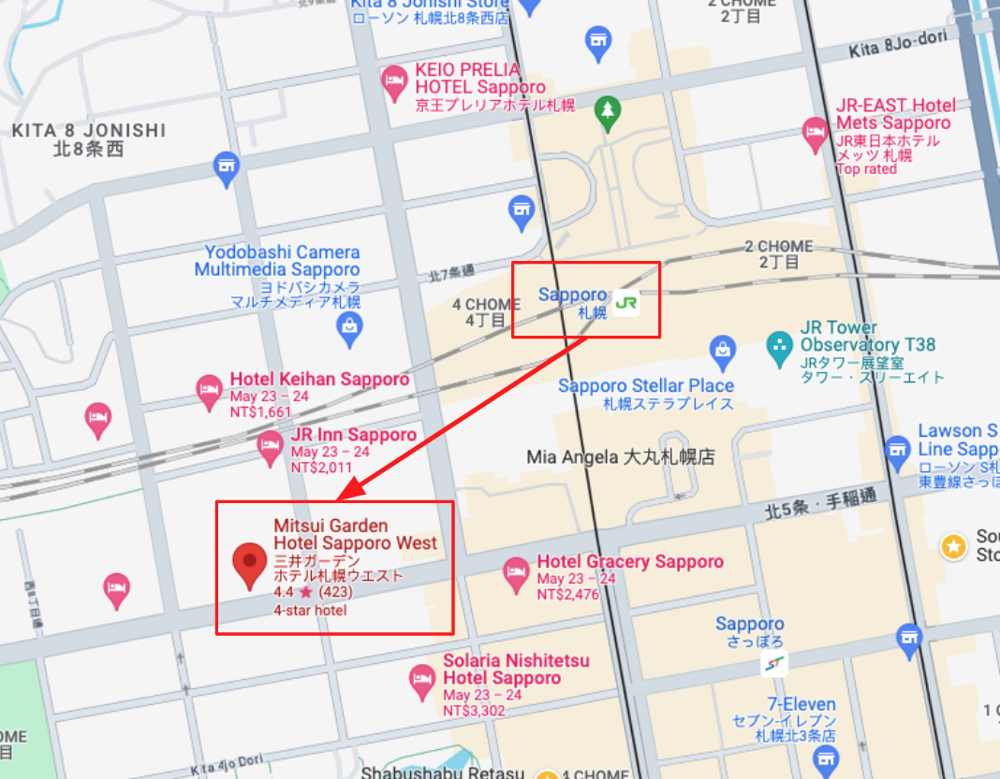
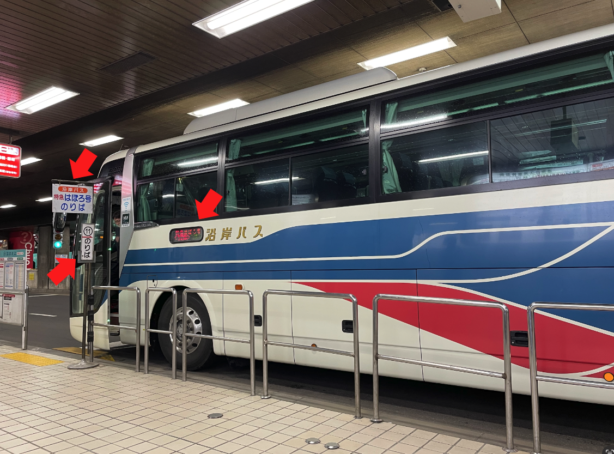
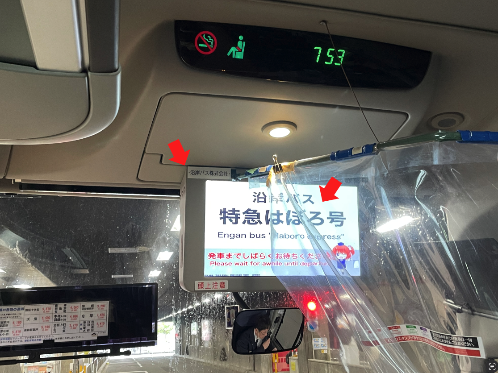
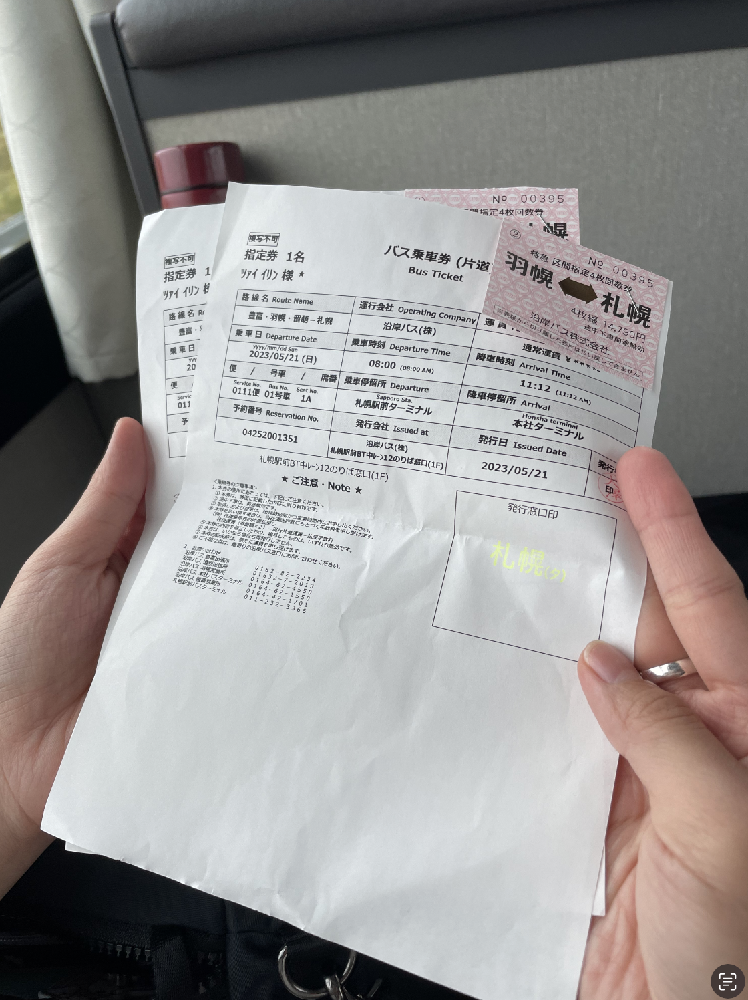
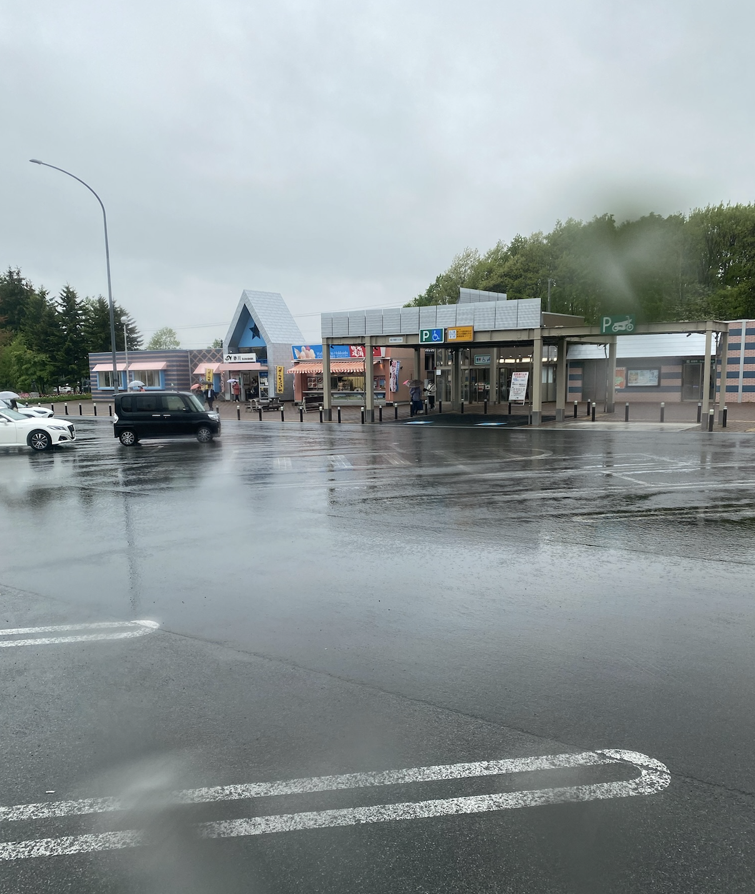
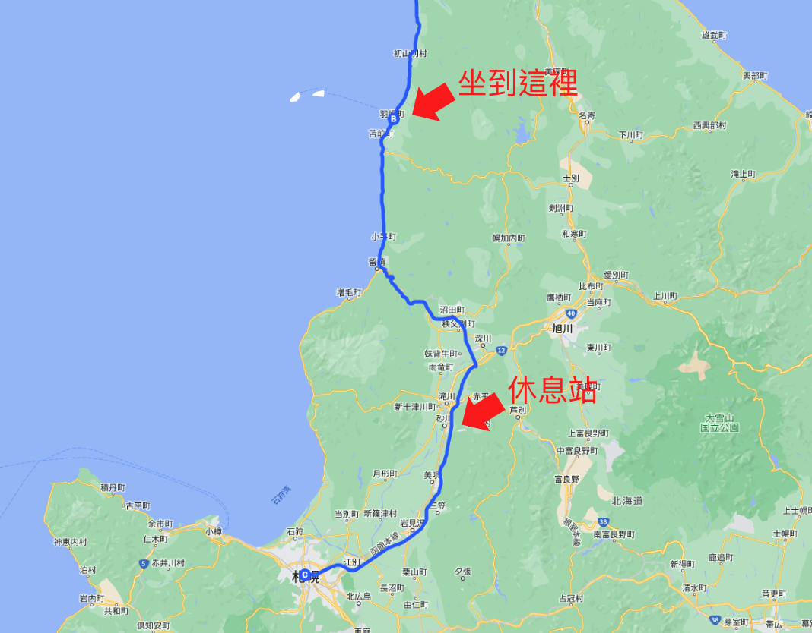
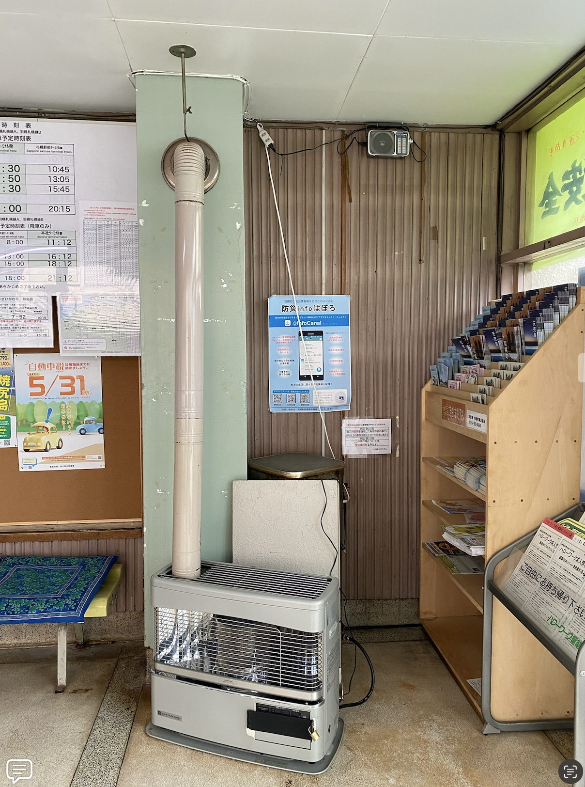
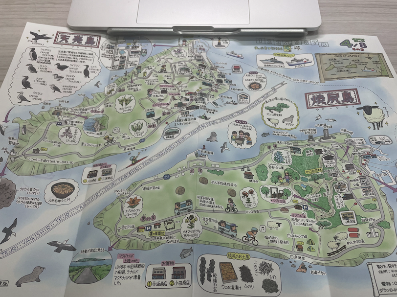

# 天売島

上圖標示天売島主要的 7 個鳥點，分別是

1. [厳島神社](https://maps.app.goo.gl/Nz2rfTboZNkyVWPN6)
2. [海竜寺](https://maps.app.goo.gl/9nhHJ9pSu2cj2gns9)和[三吉神社](https://maps.app.goo.gl/GLScWRZLAVhyvU7r6)之間步道
3. [黒崎海岸](https://maps.app.goo.gl/NeHcrmf8iSvTeeSx6)
4. [赤岩展望台](https://maps.app.goo.gl/YR2t2xV84nVwyvkp8)
5. [海鳥観察舎](https://maps.app.goo.gl/XASqdGmt8J14GNpT8)
6. [観音岬展望台](https://maps.app.goo.gl/hGMnnMsAZoqc2vkh9)
7. [愛鳥公園](https://maps.app.goo.gl/hSxJCDbeqyduQpka8)

## 懶人包

- 札幌到羽幌的巴士採預約制，請在出發的一個月前，使用 [JCB 的貴賓服務中心諮詢專線](https://www.tw.jcb/zh-tw/consumers/platinum/concierge-desk/index.html)或是請熟悉日語的朋友，打電話預約。
- 天売島的旺季是夏季。
- 當地的導遊請提早預約，網址是[天売島観光サイト「天売島.jp」](https://www.teuri.jp/)。
- 當地的住宿請提早預約。
- 船有可能因為天氣的關係停駛，旅程請抓點緩衝，至少排個 4 ~ 5 天。
- 船有沒有開請參考：[羽幌沿海フェリー](https://haboro-enkai.com/)
- 帶暈船藥。
- 注意防風保暖。

## 交通

### 新千歲機場 ⭢ 札幌

上圖是`新千歲機場`到`札幌車站`之間的 JR 路線。

我們從`新千歲機場`搭乘 `JR 千歲線`到`札幌車站`下車，車程大概 `50` 分鐘左右。

雖然也有巴士可以坐，但因為我的腸胃很常不舒服，所以還是習慣搭火車。

到了`札幌車站`後，我們先到明天搭乘巴士的售票處探路。

售票亭的營業時間是 `7:30 ～ 18:00`，我們預計是搭明天`早上八點`出發的巴士。

其實我們本來想在今天先拿票的，但已經超過營業時間。

上圖是售票亭前的佈告欄。

我們習慣會拍照紀錄，並且核對和網站寫的資訊是不是一致。

上圖是我們住宿的飯店，[三井ガーデンホテル札幌ウエスト](https://maps.app.goo.gl/7gAZQoJF9Lqt8hUx9)。

因為搭交通工具很累，我們選擇在札幌住了一天，也當作旅程的緩衝。

離車站很近走路就可以到，這樣明天早上起床就可以直接去`札幌車站`搭車。

另外我們也順便在附近的超商採買明天的早餐、威德果凍和運動飲料。

:::info
💡為什麼是威德果凍和運動飲料？

因為我有弱弱腸胃，在搭乘長途巴士之前，是不能亂吃早餐的！

麵包、蛋奶類、油脂都不能碰！
:::

### 札幌 ⭢ 羽幌

從`札幌`到`羽幌`搭乘的巴士叫做`特急はぼろ号`，公司名稱叫做`沿岸バス株式会社`。

搭乘的地點在`札幌駅`前ターミナル的中間段，編號 `11` 的搭乘站。

雖然早上八點才開車，但我們準時早上七點半就到售票亭買車票。

:::info
📍 剩下的半小時用來休息和上廁所，請務必提早到！
:::

上巴士前請確認上圖紅色箭頭指的三個地方，不要坐錯車囉！

上圖是巴士面對司機的方向，前方有個螢幕，會標示到站的站名，請再次確認巴士名稱是`特急はぼろ号`，公司名稱是`沿岸バス株式会社`。

有看到現在是 7:53 分嗎？到了 8:00 會準時開車，不等人的喔！

上圖的 A4 紙是電話預約的資料，右上角釘起來的地方則是車票本人（講本票好像怪怪的）。

:::info
📍 `特急はぼろ号`巴士的來回票是預約制。

我們是在出發的一個月前，使用 [JCB 的貴賓服務中心諮詢專線](https://www.tw.jcb/zh-tw/consumers/platinum/concierge-desk/index.html)，由專人打電話幫我們預定的。
:::

出發前只要跟站務人員核對資料就可以了，買票大概花了五分鐘左右。

上圖是`砂川休息站`的外觀，上車後大約一個半小時後，會在這裡稍作停留。

要上廁所伸懶腰的請趕快！

上圖是公車的路線圖，中間紅色箭頭處是`砂川休息站`的位置。

總車程大約是三個小時，當窗外的景色變成海之後，就代表快要到`羽幌`了。

:::info
📍 完整的巴士路線地圖請點擊[這裡](https://www.google.com/maps/d/viewer?mid=1ORkGVxz_XtF2nVgEJyxoAdXapB0&msa=0&ll=43.297614559034834%2C141.4460531734332&spn=0.041408%2C0.076647&iwloc=0004c78177c49e634f0fd&z=13)

:::

到`羽幌`後，巴士會開到一個叫做`沿岸バス 本社ターミナル`的地方，裡面沒有站務人員。

廁所在這棟建築物的後面，很舊，但非常乾淨。

上圖是候車亭裡面的暖爐。

五月中的北海道，天氣還是很冷，我們防寒衣物帶不夠，到了羽幌差不多就快不行了，後來差點冷死在天売島。

我們黏在暖爐旁邊很久。

有看到圖片右邊的書架上放很多摺頁嗎？記得去拿！

天売島手繪地圖，這張很值得收藏紀念。

天売島上的一些指引。

很漂亮的地圖。

候車亭很有年代感，上圖是裡面的手繪路線圖。

我們在這裡大概待了半小時，休息和上廁所。

上圖是`沿岸バス 本社ターミナル`到乘船處的距離，用走的大概`15`分鐘，也可以等接駁車。

接駁車非常明顯，會停在候車亭旁，不會錯過的。

乘船處也非常明顯，有個藍色絕對不會認錯的屋頂。

進去乘船處後，大門的左手邊是諮詢處，大門的右手邊是售票處。

廁所在諮詢處旁邊，進去後的通道。

因為風雨很大，我們先到上圖的諮詢處詢問，也因為這樣認識了平野先生。

### 意外的插曲

其實我們本來規劃今天就到天売島的，但風雨太大，船停駛，原本的計畫都被打亂了。

諮詢處的平野先生看我們在風雨中拖著行李箱很狼狽，於是臨時幫我們找住宿，還幫我們打電話給民宿說明。

幫我們安排好後，還提早下班載我們到處玩！！！

 

🙋‍♂️：平野先生，這樣子沒關係嗎？

 

🧔：沒關係，沒關係！！！！

 

哇嗚怎麼這麼好！超棒的！！！！！

上圖是我們遊玩的路線，其實我們還到處兜風😆

 

🙋‍♂️：欸...平野先生，早退下班到處玩真的沒關係嗎？

 

🧔：沒關係，沒關係！！！！

#### 北海道海鳥センター

上圖是從北海道海鳥センター門口往裡面拍的照片，非常推薦值得一逛。

裡頭的展示非常豐富，雖然主要都是日語解說，但我們用翻譯軟體一個一個看。

也有各種鳥類的情報。

沒有什麼要注意的地方，裡面也有很乾淨的廁所。

啊記得蓋章拿摺頁當紀念！！！！！！！

:::info
💡 北海道海鳥センター的開放時間是 09:00 - 17:00，每個禮拜一休館。
:::

#### 甘えびファクトリー 蝦名漁業部 えび漁師第51高砂丸直売店

直接上圖。

平野先生看到後非常驚恐，等下要吃晚餐了欸，你們這樣吃得下嗎？

 

🧔：我說你們會不會點太多了啊！！！！！！！！！！！

 

🫃：當然不會！晚餐是另外一個胃！！！！！！！！！！

 

:::info
📍 蝦名漁業部的營業時間是 09:00–16:00，每個禮拜日休館。
:::

#### カフェ＆イン吉里吉里

晚上我們住在`カフェ＆イン吉里吉里`，雖然房子很簡陋，但晚餐非常非常的好吃，老闆夫妻也非常親切。

招牌甜蝦特寫。

吃完後我們飽到快吐了，平野先生是對的。

### 羽幌 ⭢ 天売島

天還沒亮我就起床，準備到附近的`羽幌公園`賞鳥，上圖是我走的路線。

:::info
上班 ⭢ 睡到 10 點還在賴床，還睡不飽

賞鳥 ⭢ 天還沒亮就從床上爬起來
:::

在羽幌公園還看到狐狸，超級幸運的。

羽幌各處都可以看到崖海鴉的裝飾，很可愛。

吉里吉里的早餐非常厲害。

雖然我很怕暈船，但暈船跟早餐之間選一個，我還是會選早餐。

吃完後，民宿老闆就載我們到碼頭。

雖然天氣還是很不好，但很幸運的是船有開。

## 船班資訊

船有沒有開請參考這裡：[羽幌沿海フェリー](https://haboro-enkai.com/)

上圖是網站的截圖，請參考這邊的時間安排行程。

但船實際有沒有開要看當天的風浪，網站會有最新的通知。

旅程也請多安排一點緩衝的時間。

上圖是船的航線，航程大概兩個小時，會先到燒尻島，再到天売島。

兩個小時的航程可以看到不少海鳥海雀，幸運的話或許可以看到潛鳥。

到了天売島後，會看到民宿老闆在碼頭邊舉牌，不會認錯的。

基本上只要到了島上，其他部分就不太需要擔心了，放鬆心情賞鳥吧！

## 鳥點

鳥點的話，就是我放在最前面封面圖的那張圖，總共有 `7` 個鳥點。

上圖是[厳島神社](https://maps.app.goo.gl/Nz2rfTboZNkyVWPN6)，後面繞過去有個鎮魂碑，在這裡靜靜的等一下，會有很多鳥。

:::info
📍 請抱著敬畏的心，不要打擾到當地的神明喔！
:::

上圖是[海竜寺](https://maps.app.goo.gl/9nhHJ9pSu2cj2gns9)入口。

沿著道路走，會接一個斜坡通到`天売葬斎場`。

上圖是[三吉神社](https://maps.app.goo.gl/GLScWRZLAVhyvU7r6)。

這裡已經荒廢了，路旁都是草，行走的時候要小心。

上圖是[黒崎海岸](https://maps.app.goo.gl/NeHcrmf8iSvTeeSx6)。

雖然鷗鷗已經很習慣人類了，但我們還是習慣躡手躡腳的前進。

上圖是海雀的巢區，順著步道走，不要隨意離開步道。

有看到上面有個燈塔嗎？燈塔叫`赤岩埼灯台`，附近有個廁所。

我把相對位置標出來，這裡是陡升段，建議在燈塔這休息一下補充體力。

上圖是[赤岩展望台](https://maps.app.goo.gl/YR2t2xV84nVwyvkp8)，從海雀巢區往下走。

到了展望台往下看就是赤岩，風非常非常的大，溫度非常非常的冷！

上圖是[海鳥観察舎](https://maps.app.goo.gl/XASqdGmt8J14GNpT8)。

這裡是可以遮風避雨休息的地方，但沒有廁所。

上圖是[観音岬展望台](https://maps.app.goo.gl/hGMnnMsAZoqc2vkh9)，可以看到不少雨燕。

請依照自己的時間安排行程囉。

上圖箭頭畫起來陡升和陡降的地方要注意。

`天売郵便局`可以買明信片和蓋紀念章。

:::info
📍 在島上作客的時候，請不要打擾到當地的居民喔！
:::

## 住宿

我們住在[漁師の宿 民宿「栄丸」](http://sakaemaru.jp/)。

預約的時候我們很清楚的說明：

- 我們從哪裡來
- 來幾天
- 我們不會說日語，會使用翻譯軟體溝通
- 要來賞鳥
- 因為朋友的介紹才認識這間民宿

因為我們去的時間是 2023 年，那時候疫情剛解禁。

我們也額外說明出發前有快篩過，沒有感染武漢肺炎，是個有禮貌的孩子呢！

上圖是第一天民宿提供的晚餐。

食材非常的新鮮。

特寫。

海鮮丼飯。

 

我們真的是來賞鳥的。

 

上圖是第二天民宿提供的早餐。

上圖是[炭火海鮮 番屋](https://maps.app.goo.gl/6Y1zY5UBW81DwSdc7)的午餐。

再看一次。

來個特寫。

上圖是第二天民宿提供的晚餐。

現剖海膽，海膽還活著啊啊啊啊！！！

上圖是第三天民宿提供的早餐。

## 當地導遊

請參考這個網站 👉 [天売島観光サイト「天売島.jp」](https://www.teuri.jp/tour)

點進去後，會看到上圖預約的時間表，就是這裡了。

我們預約了兩個服務：

- 【島内ツアー】ウトウの帰巣ナイトツアー
- 【クルーズ】天売島の自然写真家・寺沢孝毅による小型ボート「ケイマフリ号」の海鳥観察＆撮影

預約完成後會收到確認信。

:::info
📍 ウトウの帰巣請在這裡預約，不需要帶手電筒，不要晚上自己去！
:::

可以看到這麼近，用手機就可以拍，

從舢舨船尾端往前看大概長這樣。

從船上往天売島看。

:::info
📍 除了在網站預約外，我們也另外跟民宿老闆說明我們有預約當地導覽的行程，因為我們不會說日語，請他們幫我們注意一下。
:::

## 租腳踏車

上圖是我們租電動腳踏車的地方，店名叫[おろろんレンタル](https://maps.app.goo.gl/jmSJpinPFG6M5ppz8)。

老奶奶非常有活力，我們跟她學很多日語，她非常的開心！

離港口很近，一到島上，我們就直接來這裡租電動腳踏車。

## 當地商店

當地只有兩家商店。

上圖是[マルサン三浦酒店](https://maps.app.goo.gl/xTrwomfzWbPk6uaz8)比較像雜貨店，店面稍微舊一點，可以挖到不少寶，老奶奶是陽岱鋼球迷，聽到我們從台灣來，還送我們紀念品。

上圖是[川口商店](https://maps.app.goo.gl/EjKCL6MTBeFFfLFG7)，比較多生鮮蔬菜，賣的東西和`マルサン三浦酒店`稍微錯開。

我們在這兩間商店補充了不少物資，餅乾、暖暖包等等，也買了不少紀念品。

## 鳥訊

- [eBird](https://www.ebird.org/)
- [iNaturalist](https://www.inaturalist.org/)

## 網站和粉絲專頁

- [TERRA images 寺沢孝毅 Official site](https://terra-images.jp/)
- [北海道海鳥センターへ](http://www.seabird-center.jp/)
- [天売島観光サイト「天売島.jp」](https://www.teuri.jp/)
- [沿岸バス株式会社](https://www.engan-bus.co.jp/)
- [漁師の宿 民宿「栄丸」](http://sakaemaru.jp/)
- [甘えびファクトリー　蝦名漁業部](https://amaebi.life/factory/)

Facebook

- [北海道海鳥センター](https://www.facebook.com/seabirdcenter)
- [天売島 バードツーリズム](https://www.facebook.com/teuribird)
- [天売島.jp  (Teuri Island)](https://www.facebook.com/teuri.jp)
- [寺沢 孝毅](https://www.facebook.com/keimafuri)
- [甘えびファクトリー　蝦名漁業部](https://www.facebook.com/profile.php?id=100057636782545)

Instagram

- [寺沢 孝毅](https://www.instagram.com/terraimages/)
- [羽幌沿海フェリー株式会社](https://www.instagram.com/haboro_enkai/)
- [羽幌町観光協会](https://www.instagram.com/haboro_kankou/)

## 住宿資訊

我整理此次旅行我們住過的旅館和民宿在這邊：

- [UNWIND HOTEL & BAR 札幌（アンワインドホテルアンドバー札幌）](https://maps.app.goo.gl/2Sd2WJHfSNx6GZ6k7)
- [カフェ＆イン吉里吉里](https://maps.app.goo.gl/7aYFjWhae9tVN3i18)
- [三井ガーデンホテル札幌ウエスト](https://maps.app.goo.gl/m3VXqJDhdXscHo9e7)
- [漁師の宿 民宿「栄丸」](http://sakaemaru.jp/)

## 行李寄放

畢竟主要的行程是賞鳥，大型行李箱我們都暫時寄放在新千歲機場，回程的時候才去拿，有兩種寄放的方式：

- [投幣式置物櫃](https://www.new-chitose-airport.jp/tw/service/baggage/locker/)

缺點是只能放三天。

- [手提行李暫時寄放、宅配、行李服務](https://www.new-chitose-airport.jp/tw/service/baggage/baggage_checkroom/)

我們是使用這個服務，要注意取件時間只到晚上八點，超過就沒辦法取件囉！
