# 苫小牧

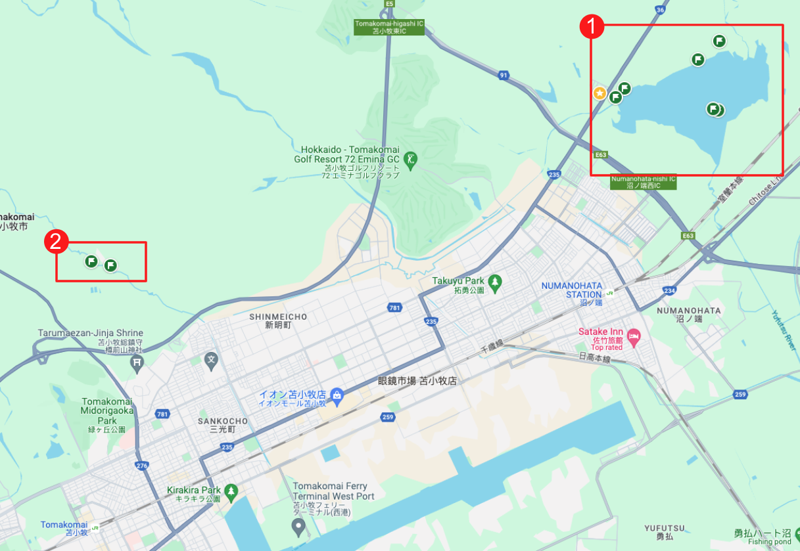

上圖紅色圈起來的地方是苫小牧市的 2 個鳥點：

1. [ウトナイ湖](https://maps.app.goo.gl/umtGEyqLMBLN4K1V8)
2. [北海道大学苫小牧研究林](https://maps.app.goo.gl/UsVFnSg2CfytGZMM9)

## 交通

### 1. 新千歲機場到苫小牧車站

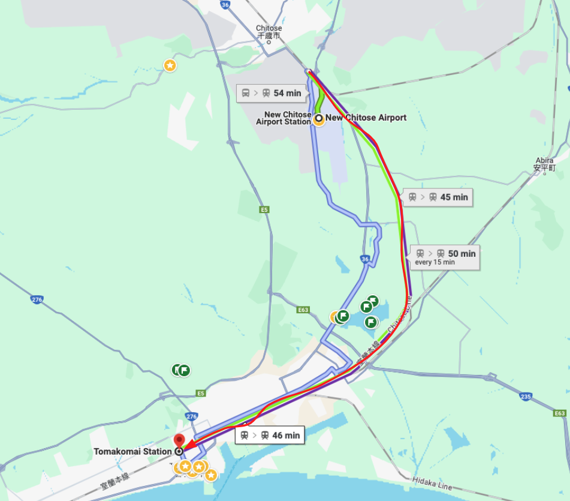

我們是從`新千歲機場`搭乘 JR `千歲線`接`室蘭本線`到`苫小牧車站`下車，車程大概 `1` 個小時左右，沿途風景滿漂亮的，也很好睡。

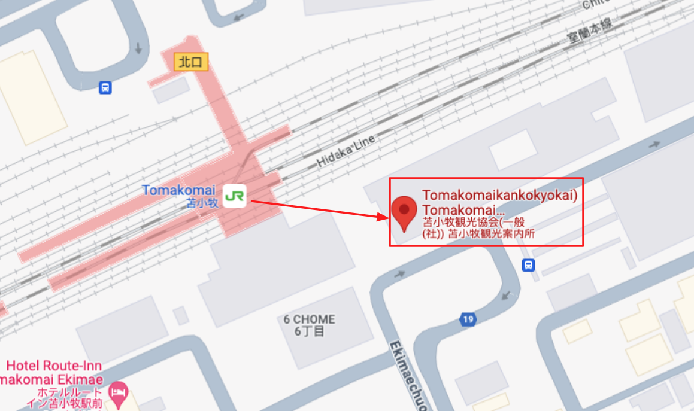

車站附近，上圖圈起來有一個叫做`苫小牧観光案内所`，是一個類似遊客中心的地方，裡面也有賣東西，如果路途上遇到什麼問題，可以來這裡詢問。

推薦裡面賣的`北寄貝醬油`，如果鳥友最近有去的話，記得幫我帶一罐！非常感謝您！好人一生平安！

店員很親切，因為我們不會講日文，所以主要用翻譯軟體溝通。

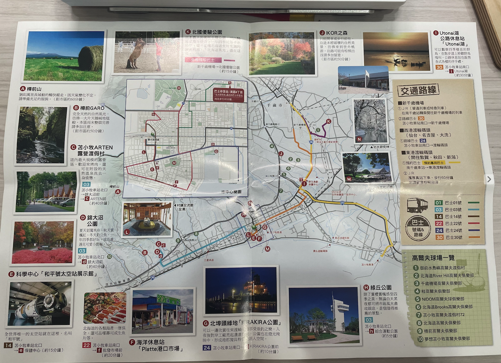

`苫小牧車站`和`苫小牧観光案内所`的櫃檯都有許多摺頁可以拿，我們習慣拿和交通有關的摺頁，雖然 Google 地圖很方便，但紙本地圖也很重要。

### 2. ウトナイ湖

到 `ウトナイ湖`要搭公車。

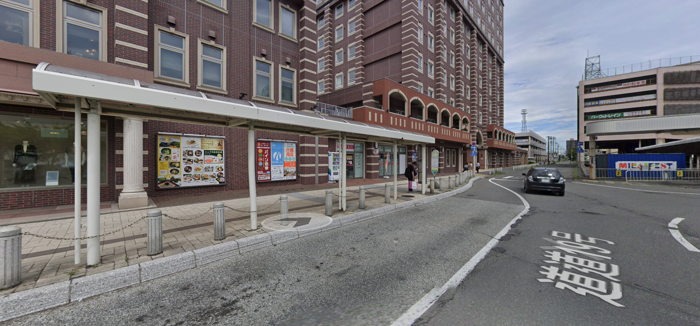

公車站長這樣。

因為我們當時差點錯過公車，把行李箱頂在頭上全力奔跑才勉強趕上，也來不及拍照，這裡只好用 Google 街景代替，真是抱歉啊啊啊啊！

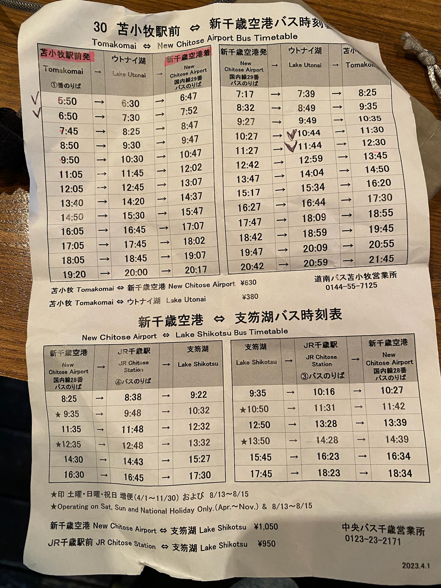

上圖是我們跟站務人員拿的公車的時刻表，左邊打勾是我們預計要去的時間，右邊是預計回程的時間。

==我們習慣在上面做記號，並且拍照留紀錄。==

要注意一個小時一班喔！

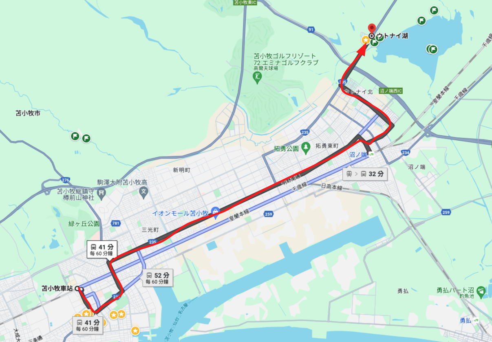

車程大約 `40` 分鐘左右，記得預先準備好零錢，免得手忙腳亂。

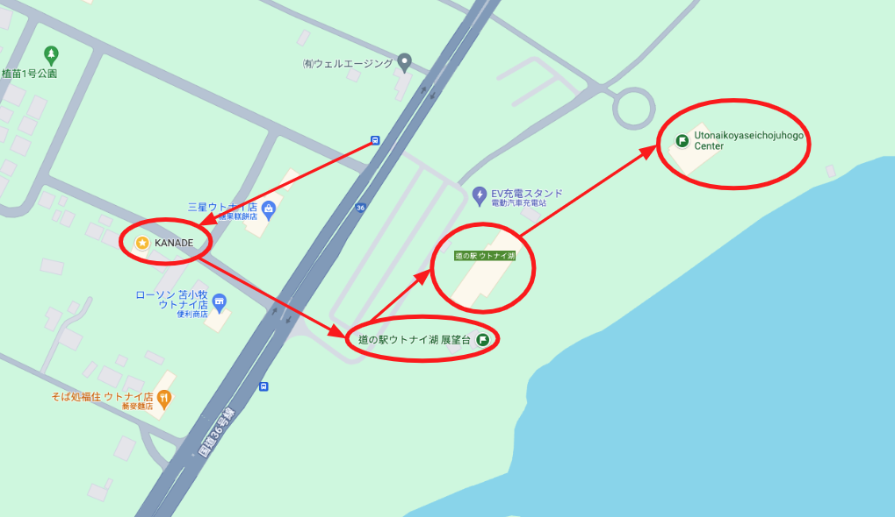

上圖圈起來的紅色圈圈，是可以休息上廁所的地方，箭頭是我們從公車站下車後走的路線。

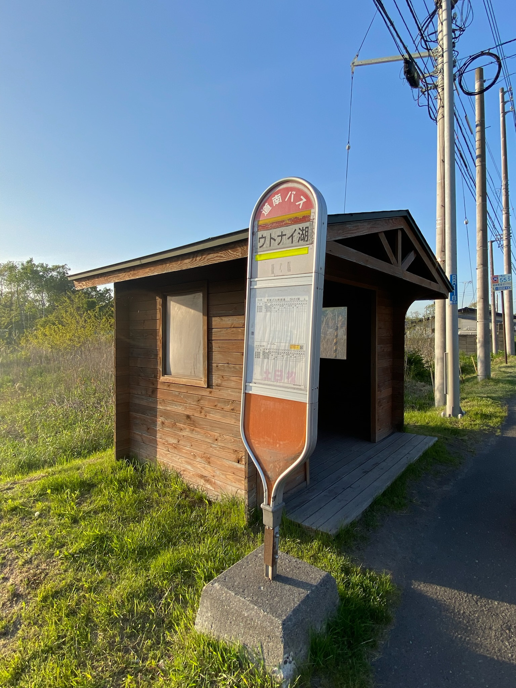

`ウトナイ湖`的公車站牌長這樣，不要坐過頭囉！

到了之後，我們先到左邊一個叫 [KANADE](https://www.instagram.com/cafe_kanade/) 的咖啡店休息和上廁所，是一棟小木屋。

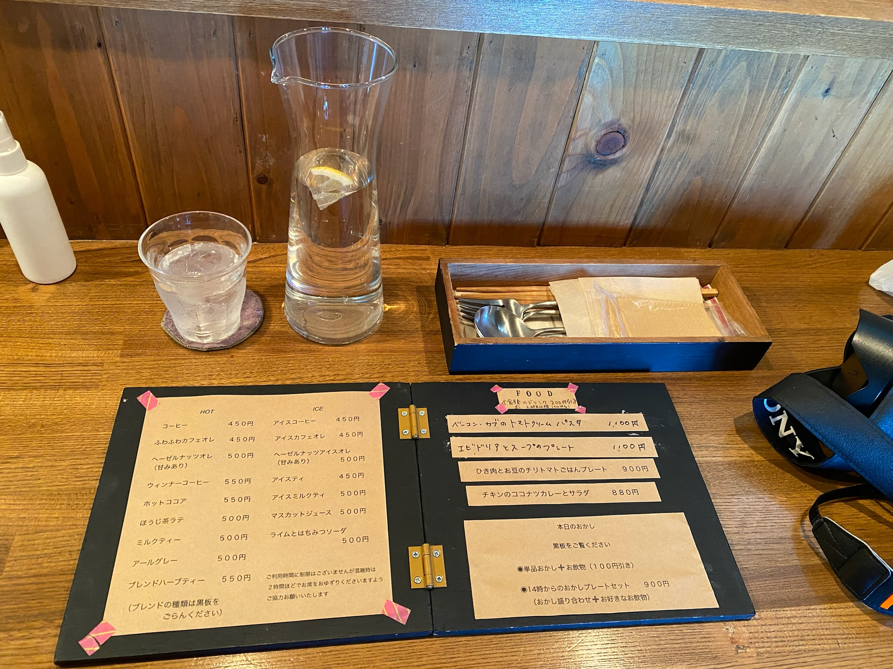

附上菜單，甜點非常非常的好吃！

老闆很親切也很漂亮！一萬顆星星推薦。

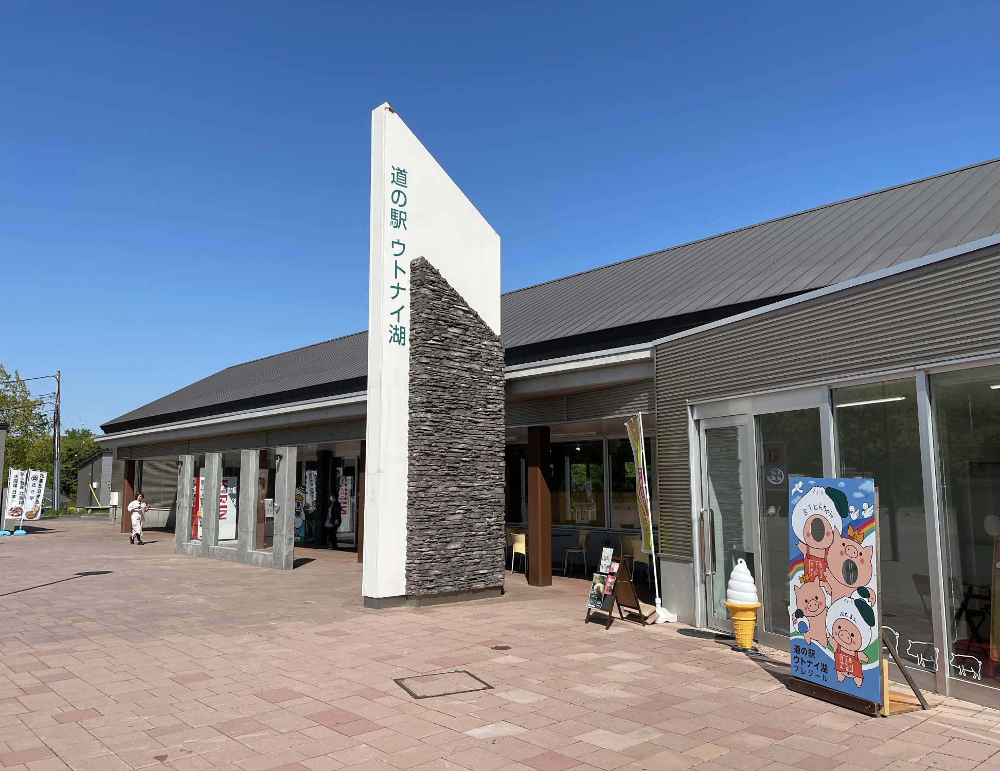

過了馬路，就是非常有名的`道之駅 ウトナイ湖`，裡面有賣各式各樣的鳥周邊和食物，一不小心錢包君就會失血太多。

 

錢包君你還好嗎？醒醒ㄚ錢包君！

 

有看到圖片右邊有個豬豬嗎？那間叫 [道の駅ウトナイ湖プレジール](https://www.instagram.com/plaisir_b1tonchan)

肉包很好吃，老闆很可愛，會用台語招呼客人喔！

bah-pau! hó-tsia̍h ê bah-pau!

:::info
📍 道の駅ウトナイ湖的營業時間是 9 AM - 5 PM。
:::

上圖是`道の駅ウトナイ湖 展望台`內部，窗戶都有貼防窗殺貼紙。

:::info
📍 道の駅ウトナイ湖展望台開放的時間是 9 AM - 5 PM。
:::

上圖是`ウトナイ湖野生鳥獣保護センター`內部，裡面有很多小朋友做的正面鳥勞作。

你們也懂正面鳥？！(請用`你剛剛攻擊我的村莊`的語氣講一遍)。

:::info
📍 ウトナイ湖野生鳥獣保護センター每個禮拜一休館，營業時間是 9 AM - 5 PM。
:::

賞鳥的話，沿著湖畔的步道走就可以了，是個非常輕鬆賞鳥行程，沒有什麼要注意的地方。

走累了就提早回去道の駅休息吧！

回程時記得算好公車來的時間，免得等太久的公車！

#### 另一個路線

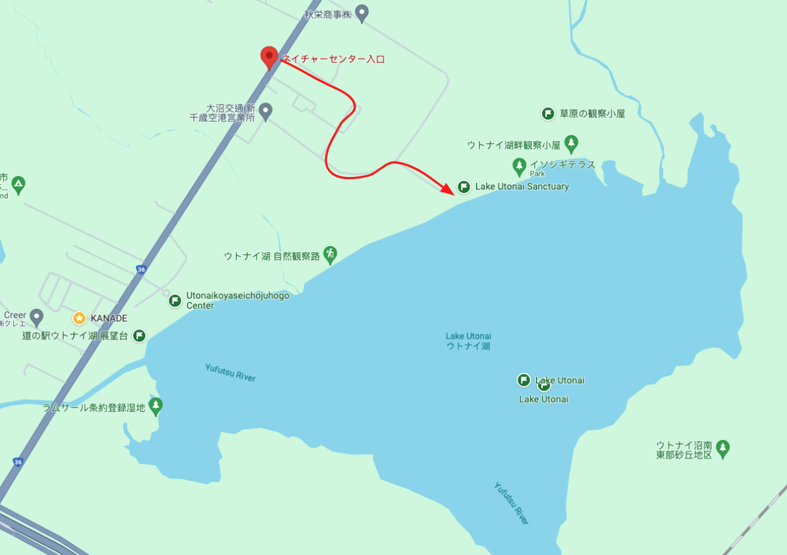

上圖是`ウトナイ湖`另一個入口，網路上有些文章提到是從這裡進去，但離道の駅比較遠。

### 北海道大学苫小牧研究林

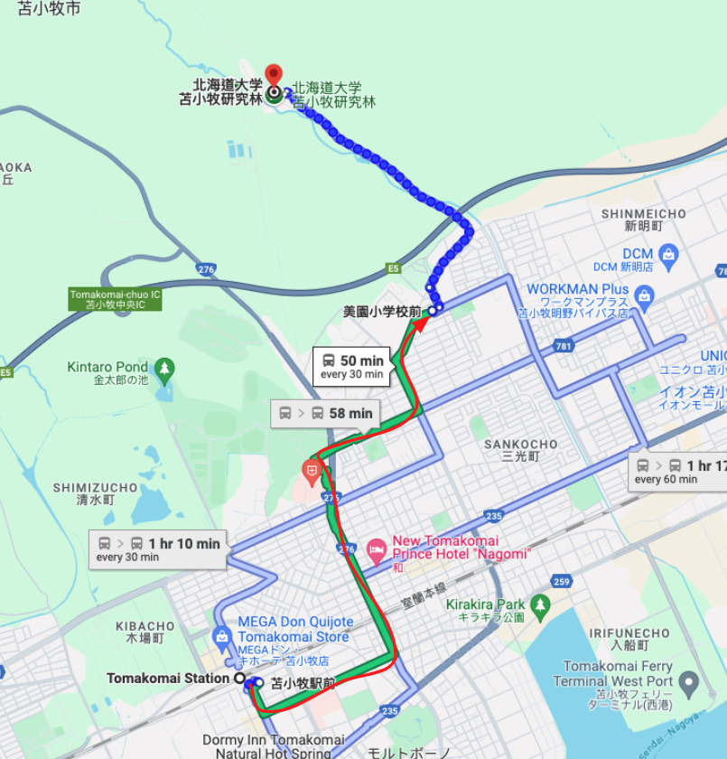

從苫小牧車站出發，在公車乘車處找`01永福三条線`這班公車。

公車搭到`美園小学校前`站，再徒步走約 40 分鐘進去`苫小牧研究林`就可以了。

因為時間的關係，我們沒有實際探訪`苫小牧研究林`，所以就沒太多心得囉！

### 苫小牧科學博物館

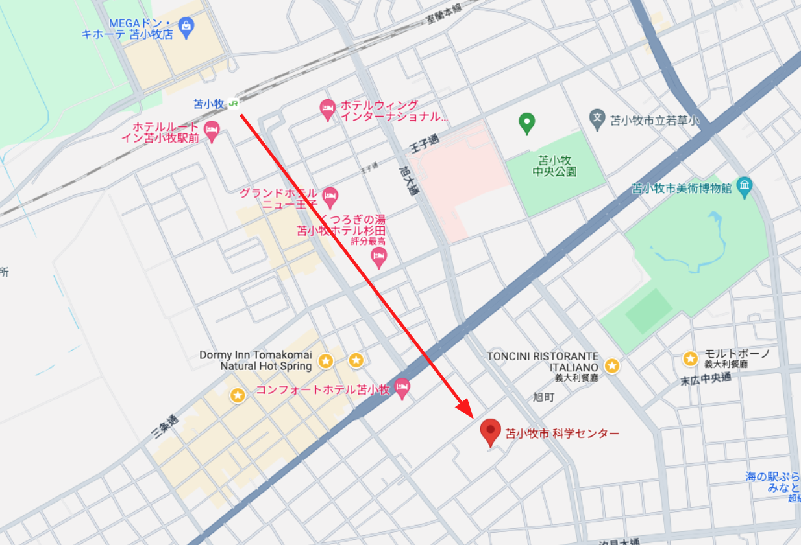

除了剛才提到的兩個鳥點外，我們還另外去了`苫小牧科學博物館`，非常推薦來這裡逛逛。

裡頭展示了各式各樣的交通機械

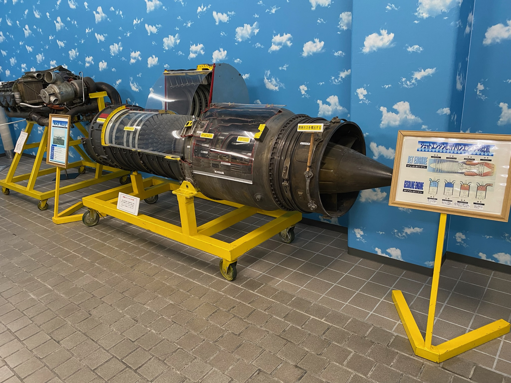

還有一艘退役的太空站

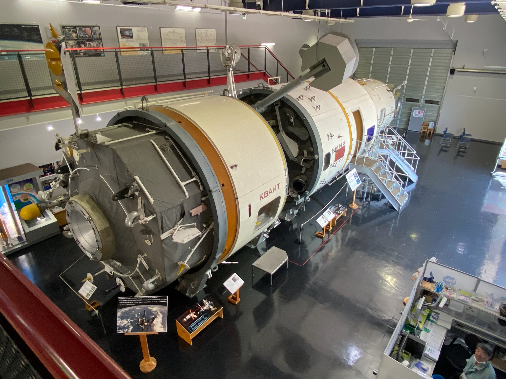

導覽員是一名退休的小學老師，非常的專業，我把我們問的鬼問題整理在這邊：

- 太空人怎麼大便？
- 現在當太空人來得及嗎？
- 太空人很無聊可不可以打電動？
- 太空人夢遊怎麼辦？
- 太空人會不會挑食？
- 老師你想上太空嗎？
- 太空人想家了怎麼辦？
- 太空食物是不是很難吃？
- 太空人會不會在裡面打架？

可能是太久沒有遇到那麼活潑可愛的遊客了，導覽員回答的非常的開心，還讓我們進去平常不開放給遊客進去的駕駛艙。

我們在這裡玩了三個小時，厲害吧！

:::info
📍 苫小牧科學博物館每個禮拜一休館，開放時間是 9:30 AM - 5 PM。
:::

## 吃吃喝喝

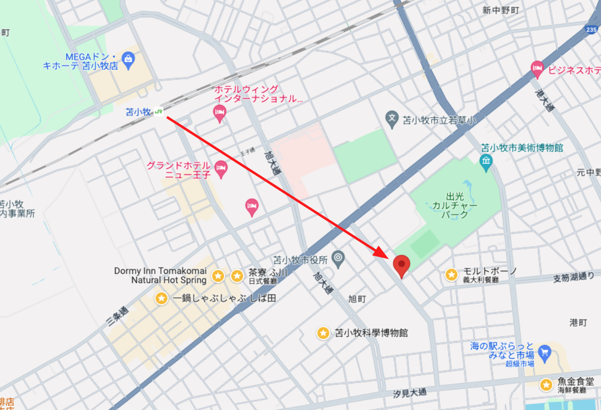

[Toncini - Ristorante italiano](https://www.instagram.com/toncini_ristorante_italiano/)

想不到在苫小牧也有非常道地的義大利餐廳！

`Toncini` 是一對很年輕的夫婦經營的，太太是日本人，先生好像是義大利人，還是哪裡人我忘了，但很帥。

隱藏在普通的民宅內

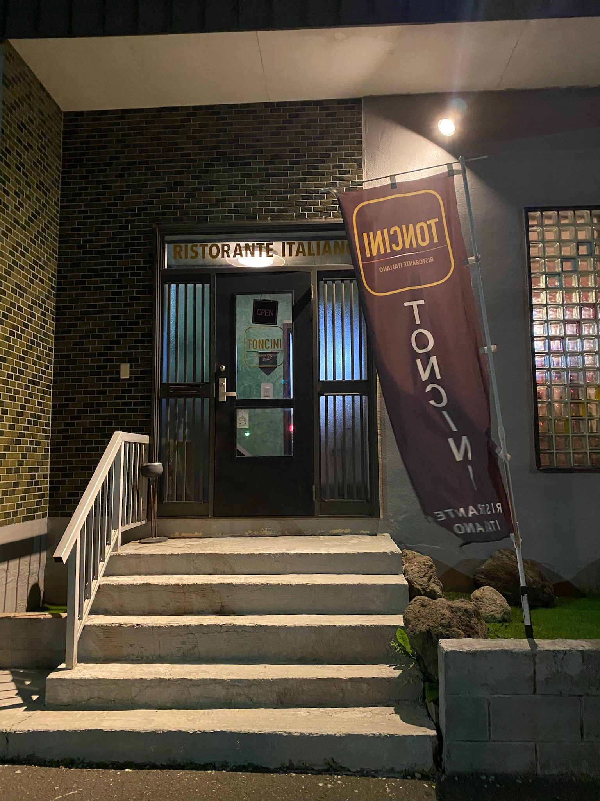

餐點非常非常的厲害，兩萬顆星推薦！

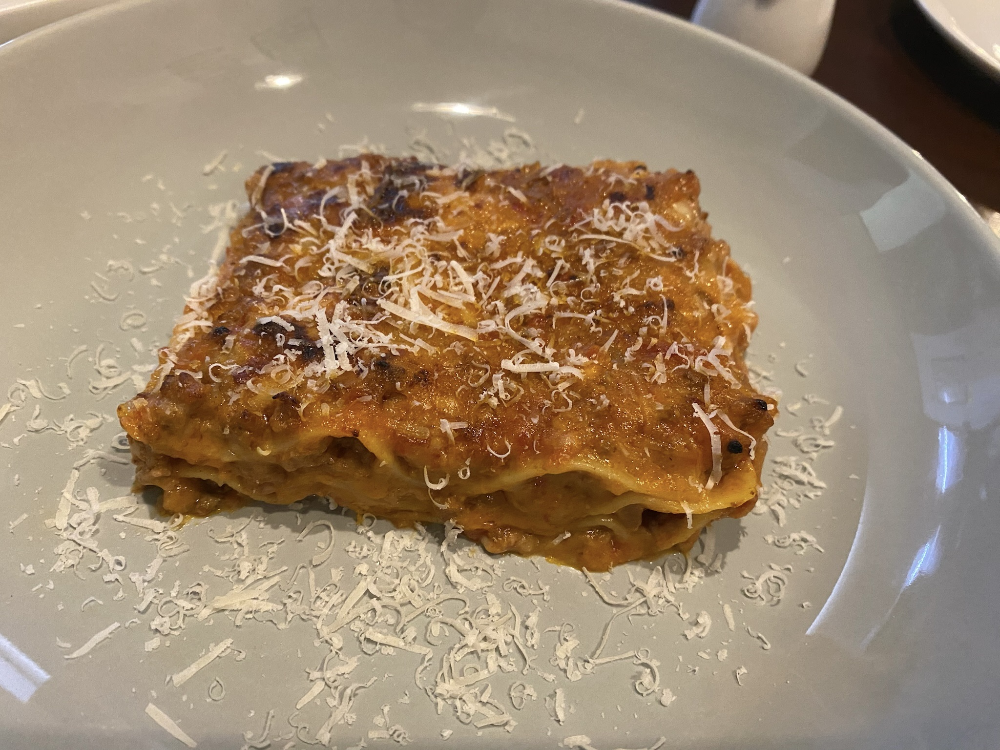

義大利麵，我可以吃一萬盤！

這是菜單的封面

## 住宿

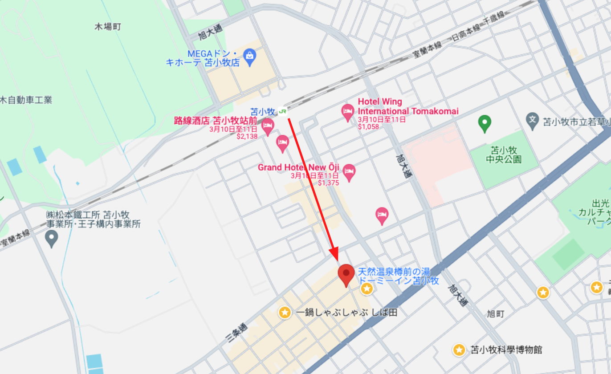

我們住在 [Dormy Inn 天然温泉樽前の湯ドーミーイン苫小牧](https://maps.app.goo.gl/zyquFViLbNtkY4CC8)，因為離車站很近。

## 鳥訊

- [eBird](https://www.ebird.org/)
- [iNaturalist](https://www.inaturalist.org/)

Facebook

- [ウトナイ湖ネイチャーセンター](https://www.facebook.com/UtonaiNatureCenter)
- [ウトナイ湖野生鳥獣保護センター](https://www.facebook.com/UtonaiWCC)

Instagram

- [ウトナイ湖ネイチャーセンター](https://www.instagram.com/utonai_nc/)
- [ウトナイ湖野生鳥獣保護センター](https://www.instagram.com/utonaiwcc/)

## 其他粉絲專頁

Facebook

- [【苫小牧】道の駅ウトナイ湖](https://www.facebook.com/michinoekiutonaiko)
- [ハンドメイド苫小牧from道の駅ウトナイ湖](https://www.facebook.com/profile.php?id=100063784582858)
- [道の駅ウトナイ湖プレジール](https://www.facebook.com/utonai.plaisir)

Instagram

- [KANADE](https://www.instagram.com/cafe_kanade/)
- [Toncini - Ristorante italiano](https://www.instagram.com/toncini_ristorante_italiano/)
- [【公式】苫小牧市科学センター](https://www.instagram.com/tomakomai_city_science_museum/)
- [ハンドメイド苫小牧from道の駅ウトナイ湖](https://www.instagram.com/handmade_tomakomai_utonaiko/)
- [苫小牧市　ふるさと納税【公式】](https://www.instagram.com/furusato_tomakomai/)
- [苫小牧観光協会](https://www.instagram.com/toma_tourism/)
- [道の駅ウトナイ湖](https://www.instagram.com/michinoeki.utonaiko/)
- [道の駅ウトナイ湖プレジール](https://www.instagram.com/plaisir_b1tonchan/)

## 行李寄放

畢竟主要的行程是賞鳥，大型行李箱我們都暫時寄放在新千歲機場，回程的時候才去拿，有兩種寄放的方式：

1. [投幣式置物櫃](https://www.new-chitose-airport.jp/tw/service/baggage/locker/)

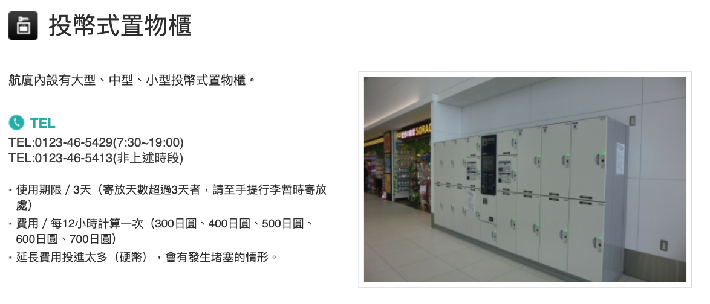

缺點是只能放三天。

2. [手提行李暫時寄放、宅配、行李服務](https://www.new-chitose-airport.jp/tw/service/baggage/baggage_checkroom/)

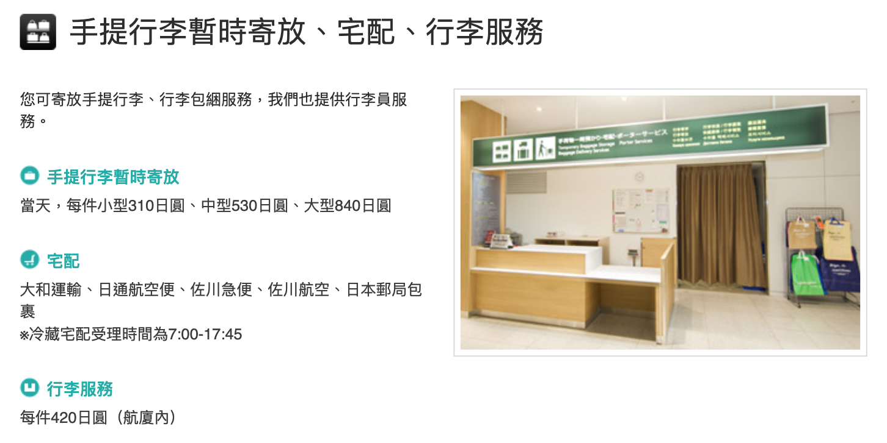

我們是使用這個服務，要注意取件時間只到**晚上八點**，超過就沒辦法取件囉！
