# 新加坡

新加坡賞鳥筆記，提供交通、住宿、廁所、飲水、賞鳥熱點等資訊。

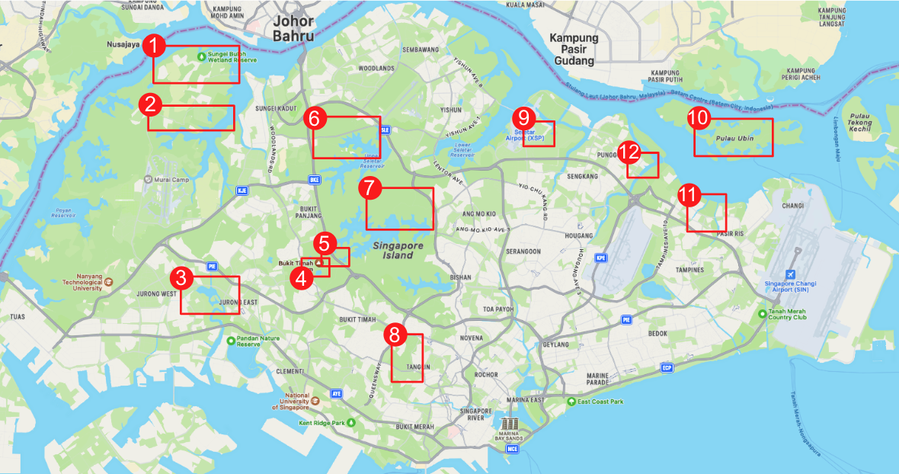

▲ 新加坡主要的 12 個賞鳥點，如果是第一次去新加坡的話，就先從這邊開始逛吧！

1. [Sungei Buloh Wetland Reserve 雙溪布洛濕地保護區](https://maps.app.goo.gl/J3fFpT4gUpZpspf37)
2. [Kranji Marshes 克蘭芝濕地](https://maps.app.goo.gl/ExHzCbTXiCV4afPf9)
3. [Jurong Lake Gardens 裕廊湖花園](https://maps.app.goo.gl/i1xoRCjerseRjjMe9)
4. [Bukit Batok Nature Park 武吉巴督自然公園](https://maps.app.goo.gl/N8i5mEUYwE4EFUQ68)
5. [Bukit Timah Nature Reserve 武吉知馬自然保護區](https://maps.app.goo.gl/1DwGAyzy4DrHy9qu8)
   - [Dairy Farm Nature Park 奶牛農場自然公園](https://maps.app.goo.gl/FSqP87hoXocpQjKz9)
   - [Hindhede Nature Park 海希德自然公園](https://maps.app.goo.gl/EhbgXGa87ubwZExk9)
   - [Rifle Range Nature Park 射靶場自然公園](https://maps.app.goo.gl/cbCPg5X9CvSXk19P6)
   - [Singapore Quarry 新加坡採石場](https://maps.app.goo.gl/1TSrF9PtEte6EfAc9)
6. [Central Catchment Nature Reserve 中央集水區自然保護區](https://maps.app.goo.gl/xBHYKziFPis4AWxh8)
   - [Bird Paradise 飛禽世界](https://maps.app.goo.gl/6mCToeubPUsZWPvY8)
   - [Night Safari 夜間動物園](https://maps.app.goo.gl/oDjc8Pbk7GhPwqsp8)
   - [Singapore Zoo 新加坡動物園](https://maps.app.goo.gl/p8MQ9PvSsPkDCFEe8)
7. [Windsor Nature Park 溫莎自然公園](https://maps.app.goo.gl/pPtcFnXBgSkw7vAQ7)
8. [Singapore Botanic Gardens 新加坡植物園](https://maps.app.goo.gl/NToKovRUcvbZimt26)
9. [Hampstead Wetlands Park 翰仕德濕地公園](https://maps.app.goo.gl/xnXpcTf5AKsFCuUY7)
10. [Pulau Ubin 烏敏島](https://maps.app.goo.gl/sGucFnZf1XD7q6C86)
11. [Pasir Ris Park 白沙公園](https://maps.app.goo.gl/D7QBPAnipD8tGac1A)
12. [Lorong Halus Wetlands 羅弄哈魯士濕地](https://maps.app.goo.gl/EiWT5U8QDwu7ZxxW8)

## 鳥點交通

### Sungei Buloh Wetland Reserve Wetland Centre 雙溪布洛濕地保護區

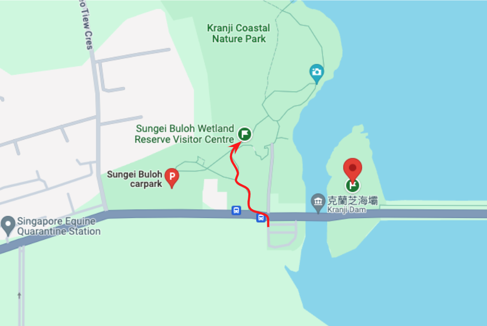

▲ 公車到達後的行走路線。

- 週一 ~ 週六：搭捷運到 `Kranji 克蘭芝 (NS7)` 站 或 `Woodlands 兀蘭 (NS9)` 站 -> `925` 號公車 -> `Kranji Reservoir Park B` 站下車，再徒步走到園區內。
- 週日：搭捷運到 `Kranji 克蘭芝 (NS7)` 站或 `Woodlands 兀蘭 (NS9)` 站 -> `925` 號公車 -> `Sungei Buloh Wetland Reserve` 站下車。

補充

- 下午常有大雷雨，如果覺得天色怪怪的請趕快離開園區。
- 入場免費，不用門票。
- 公車會在這裡迴轉，注意回程時，有兩班公車都叫做 `925`，要坐終點站往 `Woodlands` 那一班。
- 公車服務時間：06:00 - 19:49，頻率：7 ~ 14 分。
- 到站沒有廣播，記得看站牌。
- 園區內沒有供應食物，只有販賣機。
- 園區完整逛完需要一整天的時間。
- 路旁砂石車很多，要小心！
- 週一到週六公車只會到 `Kranji Reservoir Park B`，之後要自己走到保護區內，只有週日有直達園區內。
- 遊客中心裡面有個食堂，只有裡面才可以吃東西，其他地方都不行隨意飲食。
- 澤巨蜥很多，還常常懶洋洋的躺在地上，不要踢到了！

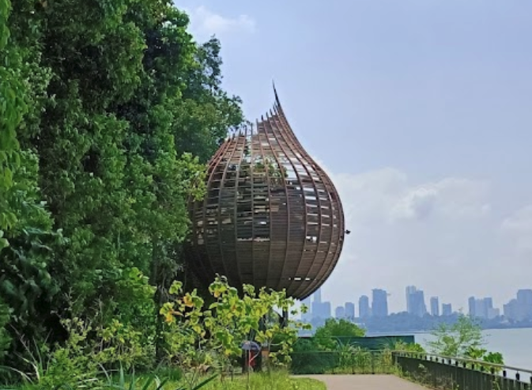

▲ 在園區裡面可以看到很多這種圓圓的東西，可以當作休息的據點。我們到達後會補充水分休息一下，慢慢前進，不然真的太熱了！

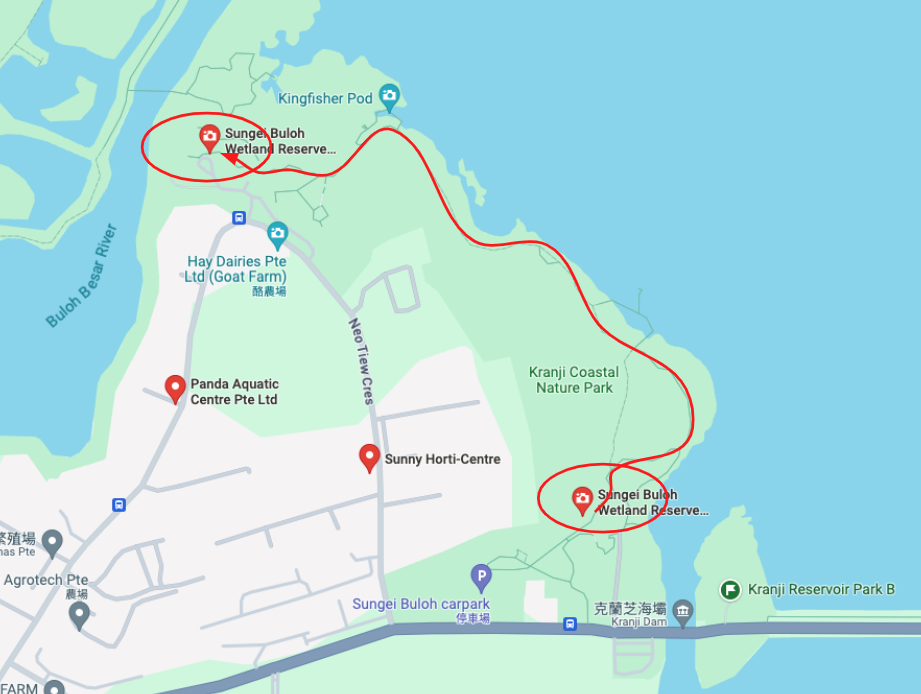

▲ 園區裡面有兩個主要的休息點，都有販賣機、飲水機和廁所。

### Singapore Botanic Gardens 新加坡植物園

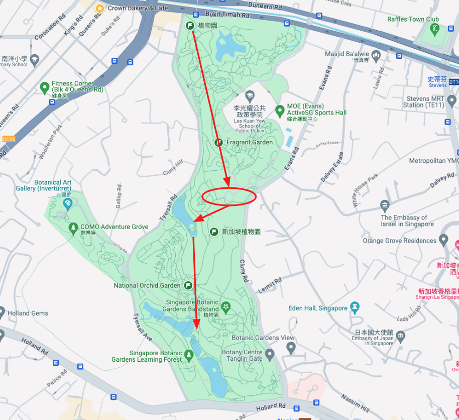

▲ 新加坡植物園的行走路線。

- 搭乘捷運 `Circle Line` 到 `Botanic Gardens 植物園 (CC19)` 站下車。
- 搭乘捷運 `Downtown Line` 到 `Botanic Gardens 植物園 (DT9)` 站下車。

補充

- 上圖圈起來是可以休息上廁所的地方。
- 中央舞台附近是熱點，可以在這裡多等一下。
- 只是單純賞鳥的話，`National Orchid Garden`可以不用去。
- 如果旅程安排的時間不長，可以直接來植物園賞鳥，這裡離市區很近、步道好走，而且鳥比較密集。
- 植物園有多個出入口，可根據下個目的地走最近的出口出去。

營業時間

- `Singapore Botanic Gardens`: 05:00 - 00:00。
- `National Orchid Garden`: 08:30 - 19:00，門票 5 新幣，折合台幣大約是 115 元。

### Gardens by the Bay 濱海灣花園

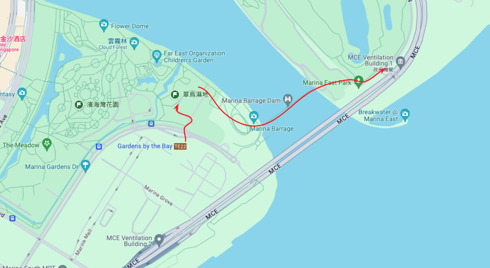

▲ 濱海灣花園的行走路線。

- 搭乘捷運 `North-South Line` 至 `Marina Bay 濱海灣 (NS27/CE2)` 站下車，再走到 `Gardens by the Bay 濱海灣花園 (TE22)` 站，或者接 `Thomson-East Coast Line` 線，坐到 `Gardens by the Bay 濱海灣花園 (TE22)` 站下車。
- 搭乘捷運 `Thomson-East Coast Line`，在 `Gardens by the Bay 濱海灣花園 (TE22)` 站下車。
- 是個不太有趣的點，但對於一般來觀光的遊客來說很有趣，走一段距離到 `Breakwater @ Marina East` 有機會撈到馬來鴴或白臉鴴。

### Pasir Ris Town Park 白沙公園

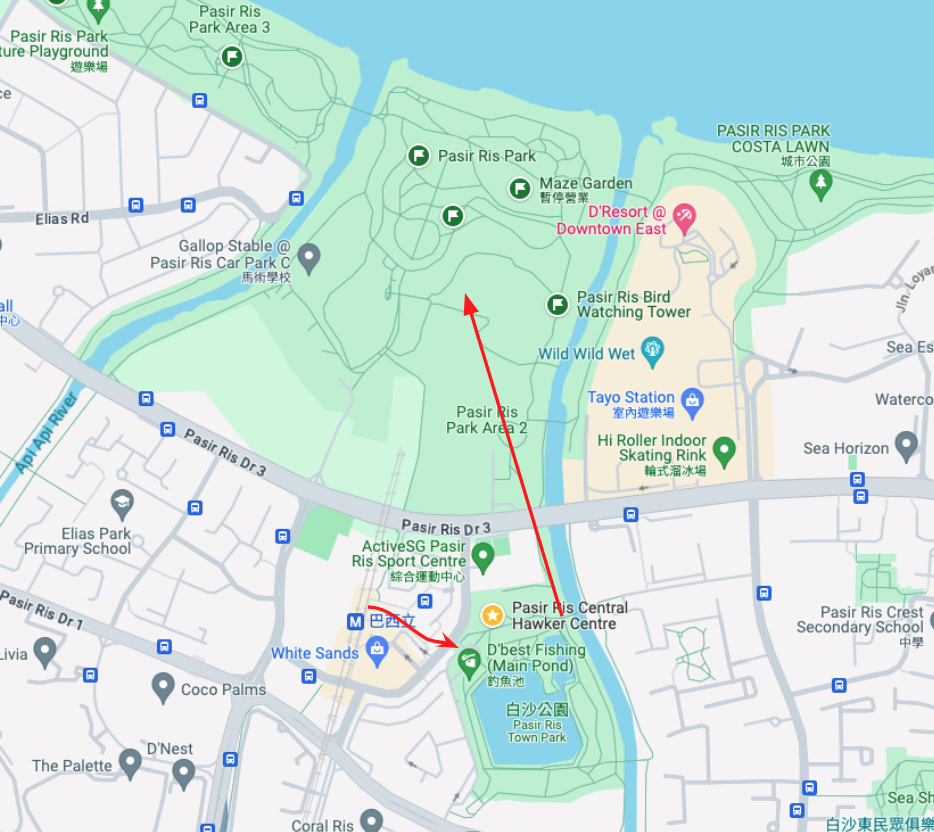

▲ 白沙公園的行走路線。

- 搭乘捷運 `East-West Line` 到 `Pasir Ris 巴西立 (EW1)` 站下車，再步行到 `Pasir Ris Town Park`。

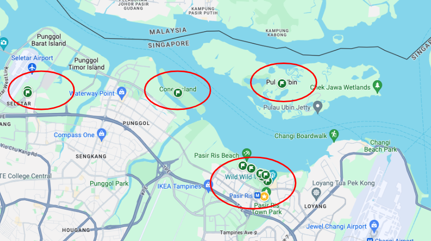

▲ 上圖圈起來的地方可以安排在一起。

### Pulau Ubin 烏敏島

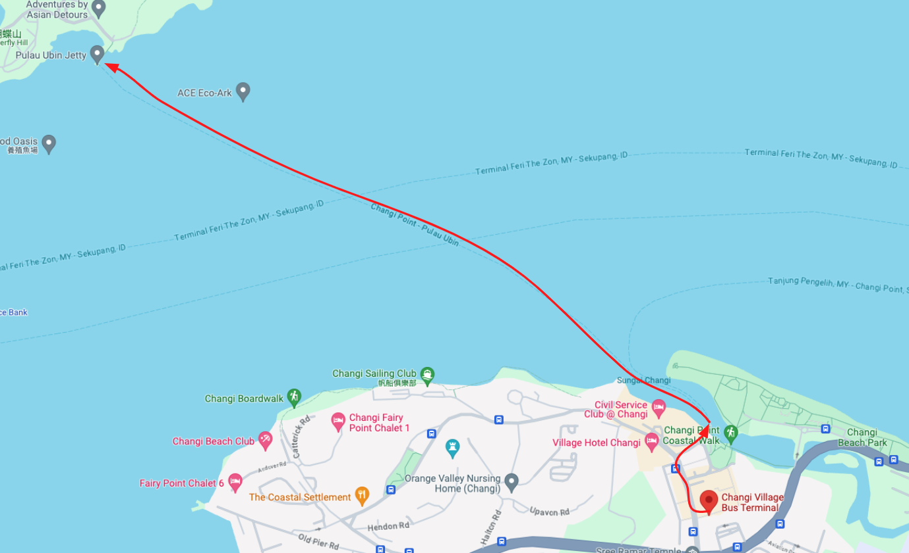

▲ 搭乘船到烏敏島。

- 從 `Pasir Ris Town Park 白沙公園` 過去的話，搭乘 `89` 號公車，到達 `Changi Village 樟宜村` 公共汽車轉運站後，再走到 `Changi Point 樟宜碼頭`搭乘渡船。
- 搭乘捷運到 `Tanah Merah 丹那美拉 (EW4)` 站，搭乘 `2` 號公車至 `Changi Village 樟宜村` 公共汽車轉運站，再走到 `Changi Point 樟宜碼頭`搭乘渡船。
- 搭乘渡船一次新幣 `4` 元，來回 `8` 元。

營業時間

- 早上 6:00 至晚上 11:00。

### Hampstead Wetlands Park 翰仕德濕地公園

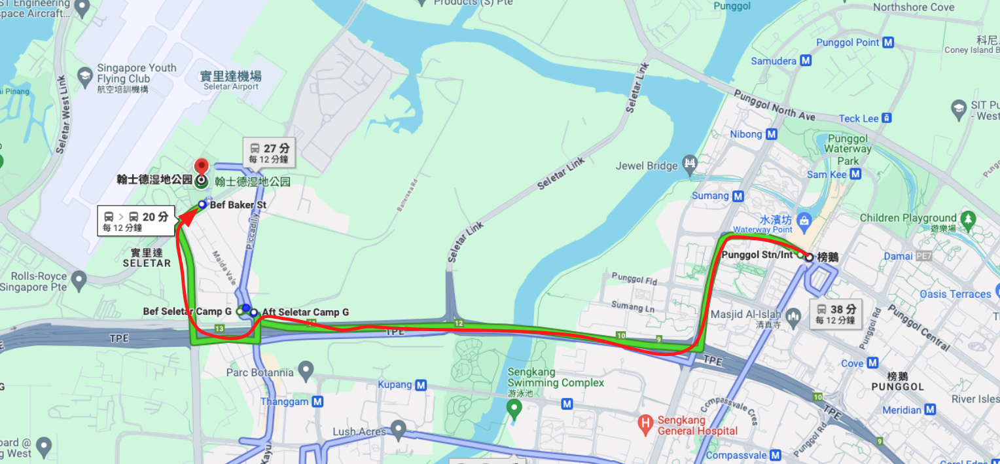

▲ 翰仕德濕地公園。

- 搭乘捷運經由 `North East Line` 線到 `Punggol 榜鵝 (NE17)` 站下車，再搭乘公車至 `Hampstead Wetlands Park`。

### Rifle Range Nature Park 射靶場自然公園

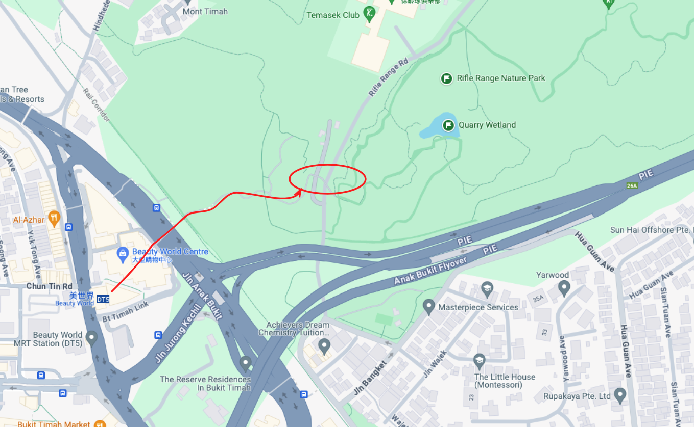

▲ 射靶場自然公園，圈起來是可以休息上廁所的地方。

- 搭乘捷運經由 `Downtown Line` 往北到 `Beauty World 美世界 (DT5)` 站下車。
- 入口在美世界購物中心樓上。
- 在購物中心可以上廁所和休息，準備好再出發。

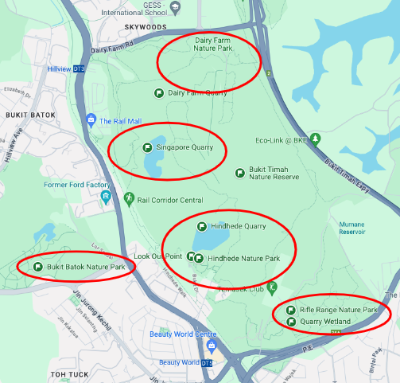

▲ 上圖圈起來的地方可以安排在一起，不過至少要抓一整天的時間賞鳥。

### Hindhede Nature Park 海希德自然公園

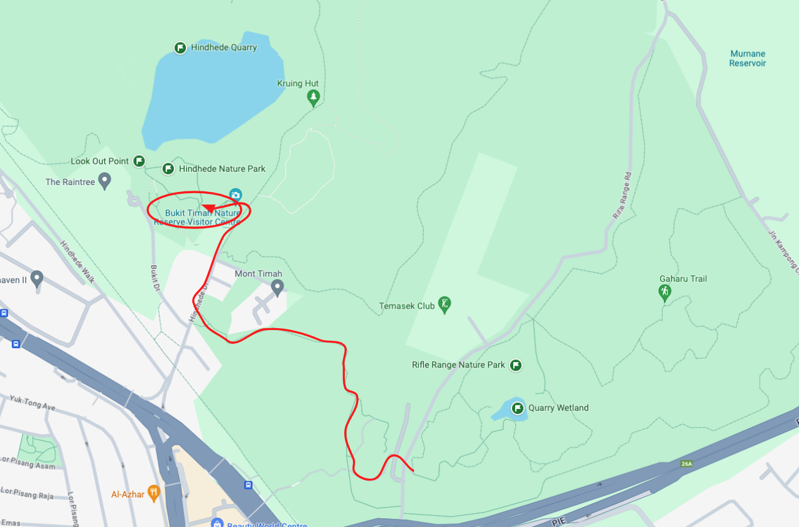

▲ 海希德自然公園，圈起來是可以休息上廁所的地方。

- 從 `Rifle Range Nature Park` 走步道過去，沿途的風景滿漂亮的。
- 步道兩旁注意一下，有機會撈到 pitta。

### Singapore Quarry 新加坡採石場

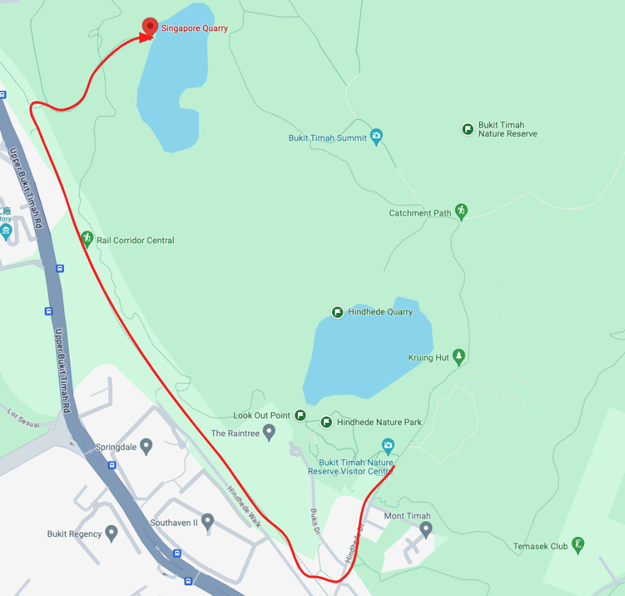

▲ 我們選擇從 `Hindhede Nature Park` 走過去，雖然是平地，但距離也不近，如果還有其他行程的話建議搭公車，保留一點體力。

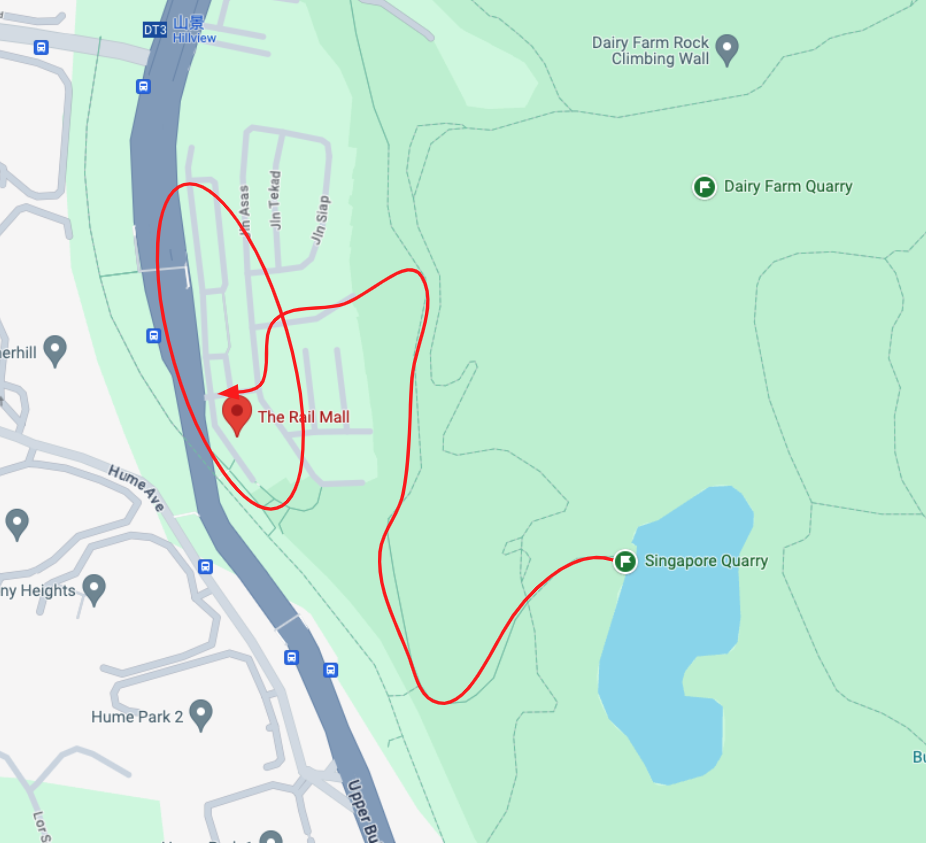

▲ 圈起來的地方有一整排美食街，可以吃飯和休息。再往上就是捷運 `Hillview 山景 (DT3)` 站，從那裡搭車回家。

### Bukit Batok Nature Park 武吉巴督自然公園

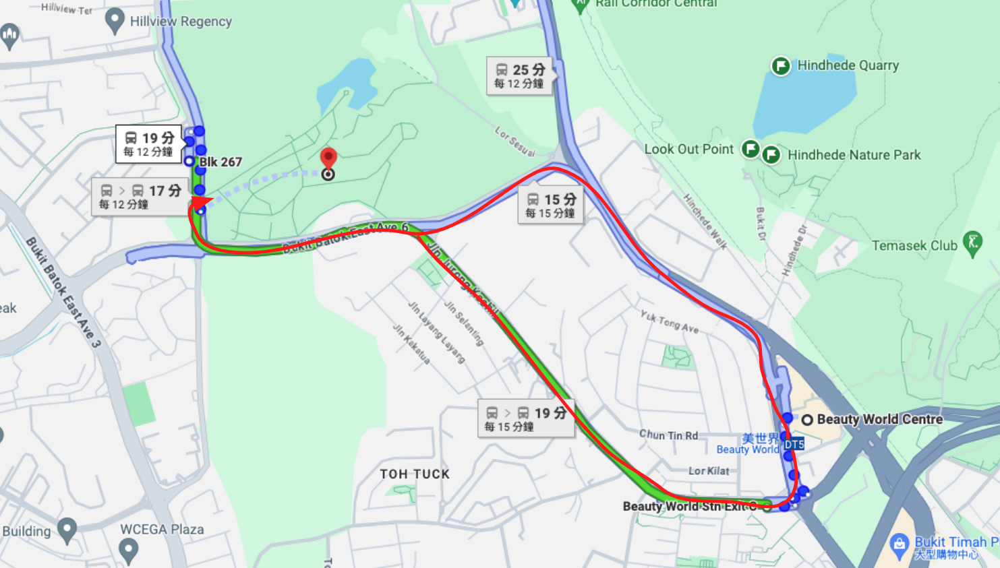

▲ 武吉巴督自然公園。

- 搭乘捷運經由 `Downtown Line` 線到 `Beauty World 美世界 (DT5)` 站下車，再徒步或是搭乘公車至 `Bukit Batok Nature Park`。

### Windsor Nature Park 溫莎自然公園

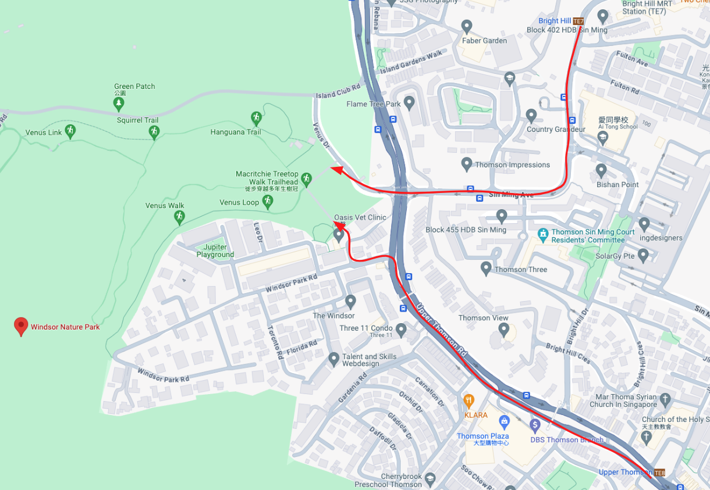

▲ 溫莎自然公園。

- 搭乘 `Thomson East Coast Line` 線，至 `Upper Thomson 湯申路上段 (TE8)` 站下車，再徒步或是搭乘公車至 `Windsor Nature Park`。
- 搭乘 `Thomson East Coast Line` 線，至 `Bright Hill 光明山 (TE7)` 站下車，再徒步或是搭乘公車至 `Windsor Nature Park`。

### Jurong Lake Gardens 裕廊湖花園

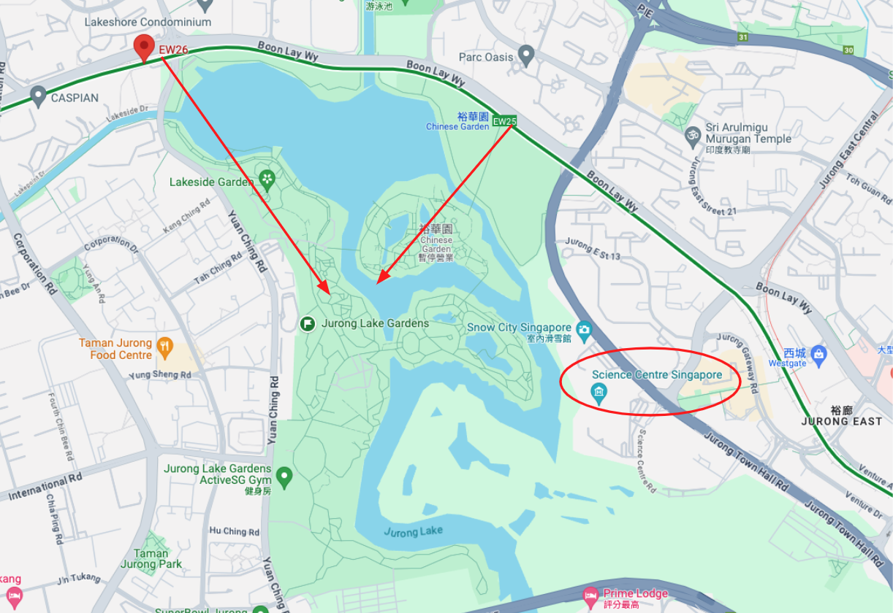

▲ 圈起來的地方是科學博物館，可以參觀或休息。

- 搭乘 `East West Line` 線，至 `Chinese Garden 裕華園 (EW25)` 站下車，再走到 `Jurong Lake Gardens`。
- 搭乘 `East West Line` 線，至 `Lakeside 湖畔 (EW26)` 站下車，再走到 `Jurong Lake Gardens`。

## 鳥訊

- [Birds of Singapore](https://singaporebirds.com/)
- [Wiki - List of birds of Singapore](https://en.wikipedia.org/wiki/List_of_birds_of_Singapore)
- [eBird](https://ebird.org/home)
- [iNaturalist](https://www.inaturalist.org/)

### Facebook

- [Bird Sightings](https://www.facebook.com/groups/1407072732845076)
- [Birding Singapore](https://www.facebook.com/birdingsg/)
- [Nature Society Singapore](https://www.facebook.com/groups/naturesocietysingapore/)
- [Singapore Birders](https://www.facebook.com/groups/singaporebirdgroup)
- [Singapore Wildlife Sightings](https://www.facebook.com/groups/179531089457)
- [Wild Bird Club Singapore](https://www.facebook.com/groups/1859513570978226/)

### Instagram

- [@birds_cupids](https://www.instagram.com/birds_cupids/)
- [@hyjgoesbirding](https://www.instagram.com/hyjgoesbirding)
- [@naturewongsg](https://www.instagram.com/naturewongsg)
- [@singapore_birds](https://www.instagram.com/singapore_birds/)
- [@singapore_creatures](https://www.instagram.com/singapore_creatures/)
- [@singaporebirder](https://www.instagram.com/singaporebirder/)
- [@singaporebirds](https://www.instagram.com/singaporebir)
- [@singaporebirdsjiji](https://www.instagram.com/singaporebirdsjiji/)
- [@wild.singapore](https://www.instagram.com/wild.singapore/)
- [@wildlifesingapore](https://www.instagram.com/wildlifesingapore/)

## 吃吃喝喝

- Toast Box 土司工坊
- Ya Kun Kaya Toast 亞坤咖椰吐司
- [328 Katong Laksa](https://maps.app.goo.gl/xCENg5HQ6SGiZU7EA)
- [Crown Bakery & Cafe](https://maps.app.goo.gl/aZnEvVQ3KrrhMHXE9)
- [Jia Bin Klang Bak Kut Teh 嘉宾 巴生肉骨茶](https://maps.app.goo.gl/oxaMjMNkq67RzeuJ8)
- [The Coconut Club](https://maps.app.goo.gl/f8JuzfHxbfNmVCsk6)
- [五十年代](https://maps.app.goo.gl/vcRTXFoSUoPsUiyj6)
- [喜園](https://maps.app.goo.gl/a4eJK6GAAzdGAYmdA)
- [天天海南雞飯](https://maps.app.goo.gl/DJPpG3c8wH1jSztz9)
- [東亞餐室](https://maps.app.goo.gl/dS1mAjtC5JM5sm2F6)
- [松發肉骨茶](https://maps.app.goo.gl/eAjA1qTHd1pk76UX7)
- [林志源肉乾](https://maps.app.goo.gl/6rJKzWR8ztSoLvJx6)
- [結霜橋叻沙](https://maps.app.goo.gl/yr9mPrJVLykoxUGGA)
- [阿秋甜品](https://maps.app.goo.gl/PXHaC5UYdaPN5bzy8)

## 地名縮寫

在一些論壇會看有人回報鳥訊的地名，會用每個詞的第一個字母當作縮寫，列幾個常見的在這裡，其他依此類推：

- `HNP`: Hindhede Nature Park 海希德自然公園
- `JLG`: Jurong Lake Gardens 裕廊湖花園
- `PRP`: Pasir Ris Park 白沙公園
- `RRNP`: Rifle Range Nature Park 射靶場自然公園
- `SBG`: Singapore Botanic Gardens 新加坡植物園
- `SBWR`: Sungei Buloh Wetland Reserve 雙溪布洛濕地保護區
- `WNP`: Windsor Nature Park 溫莎自然公園
- `PU`: Pulau Ubin 烏敏島

## 其他

- 下午很常下雷雨，覺得天氣哪裡怪怪的話，請趕快找好躲避的地方。
- 不太清楚看到公車來要不招手，但我們都靠眼神。
- 不需要買 ez-link 卡，用信用卡刷捷運就好。
- 在新加坡的超市可以買到泰山八寶粥，沒錯！就是泰山八寶粥，一罐 1.2 新幣不貴，折和台幣大概 30 幾元，準備 1 ~ 2 罐放在背包，可充當午餐，吃起來有懷念的台灣味道。
- 廁所提供的衛生紙很粗，自己帶的衛生紙比較好用。
- 很多小吃攤都不供衛生紙，自己準備面紙擦嘴巴，濕紙巾擦手。
- 新加坡公車很多都不會廣播站名，要自己注意下車的時機。
- 新加坡很熱，做好防曬，不要中暑了。
- 新加坡捷運站跟站之間的距離很遠，把握坐車的時間休息吧！
- 準備一些零錢，雖然到處都有販賣機，但有些販賣機不提供刷卡的。
- 漫遊的話，用量其實不大，因為新加坡到處都可以連 Wi-Fi，再加上出發前已經查好交通，使用最基本的方案就可以了。
- 雙層公車能不要上去樓上就不要上去，樓梯很滑，看到有人從上面摔下來。
