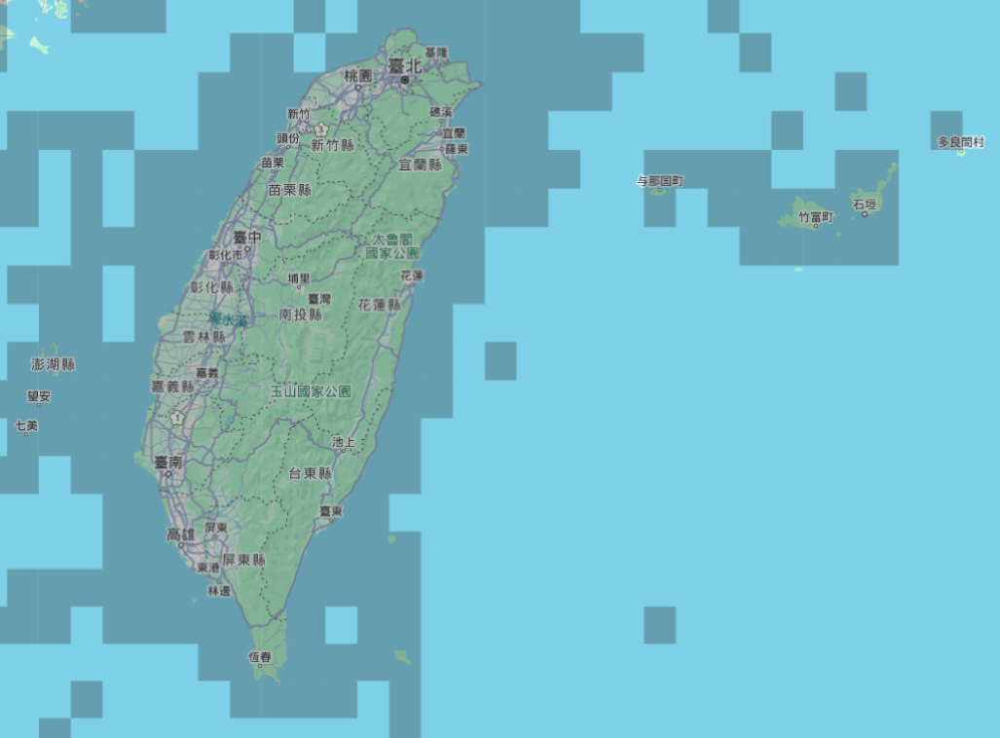

# eBird 繁體中文地圖

📦 [點此至 Google Chrome 線上應用程式商店下載](https://chromewebstore.google.com/detail/ebird-localization/fehgcalgkkjfemgocipbabpkoemcgbnj)

## 功能

1. 在 eBird 顯示繁體中文地圖。
2. 安裝好後到 eBird 網頁即可顯示繁體中文，不需要任何設定。

## Bug 回報或是功能建議

有任何操作上的建議或是問題，請聯繫 minsiansu@gmail.com。
