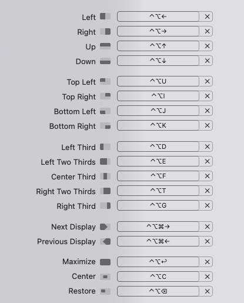

# Mac Setup Guide for DevOps/SRE

:::success
Make sure you are already connected to the company's WiFi
:::

## 1. Setup Bluetooth for External Devices

- [ ] **Keyboard**
- [ ] **Trackpad/Mouse**
- [ ] **AirPods**

## 2. System Settings

- [ ] **Update User Password**
    - Go to **Users & Groups** and change the default user password.
- [ ] **Keyboard Configuration**
    - Go to **System** > **Keyboard**:
        - Increase the `Key Repeat Rate`.
        - Shorten the `Delay Until Repeat`.
    - **Disable Press-and-Hold for Keys**:
        - Open Terminal and run:
        ```bash
        defaults write -g ApplePressAndHoldEnabled -bool false
        ```
        - [Reference](https://discussions.apple.com/thread/3646726?sortBy=rank)
- [ ] **Trackpad Speed**
    - Go to **Trackpad** > **Point & Click**:
        - Increase the `Tracking Speed`.
- [ ] **Appearance Settings**
    - Go to **Appearance** and update your personal settings.
- [ ] **Desktop & Dock Settings**
    - Go to **Desktop & Dock** and update your personal settings.
- [ ] **Wallpapers**
    - Go to **Wallpapers** and set your preferred wallpaper.

## 3. Jamf Self Service for macOS Downloads

- [ ] **Apps**
   - [ ] [Bitwarden](https://bitwarden.com) / [1Password](https://1password.com)
   - [ ] [Keynote](https://www.apple.com/keynote/)
   - [ ] [Line](https://line.me)
   - [ ] [Magnet](https://magnet.crowdcafe.com)
   - [ ] [Numbers](https://www.apple.com/numbers/)
   - [ ] [Pages](https://www.apple.com/pages/)
   - [ ] [Postman](https://www.postman.com)
   - [ ] [Proxyman](https://proxyman.io)
   - [ ] [Spotify](https://www.spotify.com)
   - [ ] [TablePlus](https://tableplus.com)
   - [ ] [Telegram](https://telegram.org)
   - [ ] [Xcode](https://developer.apple.com/xcode/)

## 4. Setup Magnet/Rectangle/Spectacle



## 5. Download & Install from Browser

- [ ] **Using Multiple browsers for safety**
    - [Microsoft Edge](https://www.microsoft.com/en-us/edge/download?form=MA13FJ)
    - [Google Chrome](https://www.google.com/intl/en_uk/chrome/dr/download)
    - [Brave](https://brave.com/)
- [ ] **Development Tools**
    - [iTerm2](https://iterm2.com/)
    - [Microsoft Visual Studio Code](https://code.visualstudio.com/)

## 6. Browser Setup

- [ ] **Add Bookmarks Folders**
    - [ ] Company Page
    - [ ] AI Tools
    - [ ] AWS/GCP
    - [ ] Database Tools
- [ ] **Use DuckDuckGo !Bang Search for quick access**
    - Set search query: `https://duckduckgo.com/?kao=-1&kak=-1&kax=-1`
    - [Reference](https://duckduckgo.com/bangs)
- [ ] Disable `Save and fill basic info`
- [ ] Disable `View and autofill passwords and passkeys`
- [ ] Disable `Offer to save passwords`
- [ ] Disable `Save and fill payment info`

## 7. Setup Slack

- [ ] **Upload Profile Photo**
- [ ] **Update Display Name**
- [ ] **Configure Timezone**
- [ ] **Configure Google Calendar APP**

## 8. Setup Gmail

- [ ] **Configure Filters**
    - **Criteria**:
      ```
      Matches: subject:(New login) OR (New Device Logged) OR (sign-in from new location) OR (Login alert)
      ```
    - **Action**:
      ```
      Mark as read and apply the label "login-notification"
      ```
- [ ] **Add Company Signatures**

## 9. Terminal Setup

- [ ] **Install [Homebrew](https://brew.sh/)** (requires sudo privileges)
- [ ] **Install [zimfw](https://github.com/zimfw/zimfw)**
    - [ ] Run:
      ```bash
      curl -fsSL https://raw.githubusercontent.com/zimfw/install/master/install.zsh | zsh
      ```
    - [ ] **Download zimfw Settings**
        - Copy and paste the settings from [zshrc](./zim-zshrc.md) and [zimrc](./zim-zimrc.md)

## 10. Install via Homebrew

- [ ] **Install Homebrew Packages**
  - [ ] [ansible-lint](https://formulae.brew.sh/formula/ansible-lint)
  - [ ] [ansible](https://formulae.brew.sh/formula/ansible)
  - [ ] [awscli](https://aws.amazon.com/cli/)
  - [ ] [colordiff](https://github.com/daveewart/colordiff)
  - [ ] [coreutils](https://www.gnu.org/software/coreutils/)
  - [ ] [direnv](https://direnv.net)
  - [ ] [eksctl](https://eksctl.io)
  - [ ] [fd](https://github.com/sharkdp/fd)
  - [ ] [gawk](https://www.gnu.org/software/gawk/)
  - [ ] [git-delta](https://github.com/dandavison/delta)
  - [ ] [glab](https://gitlab.com/gitlab-org/cli)
  - [ ] [gnu-sed](https://www.gnu.org/software/sed/)
  - [ ] [gnu-tar](https://www.gnu.org/software/tar/)
  - [ ] [gnu-which](https://www.gnu.org/software/which/)
  - [ ] [hashicorp/tap/packer](https://developer.hashicorp.com/packer)
  - [ ] [helm](https://helm.sh)
  - [ ] [ipcalc](http://jodies.de/ipcalc)
  - [ ] [jq](https://formulae.brew.sh/formula/jq)
  - [ ] [k9s](https://k9scli.io)
  - [ ] [kubectl](https://kubernetes.io/docs/tasks/tools/#kubectl)
  - [ ] [kubectx](https://github.com/ahmetb/kubectx)
  - [ ] [lazygit](https://github.com/jesseduffield/lazygit)
  - [ ] [mise](https://github.com/jdx/mise)
  - [ ] [neovim](https://neovim.io)
  - [ ] [ngrok](https://formulae.brew.sh/cask/ngrok)
  - [ ] [orbstack](https://orbstack.dev)
  - [ ] [ranger](https://github.com/ranger/ranger)
  - [ ] [ripgrep](https://github.com/BurntSushi/ripgrep)
  - [ ] [ruff](https://github.com/astral-sh/ruff)
  - [ ] [terraformer](https://github.com/GoogleCloudPlatform/terraformer)
  - [ ] [terragrunt](https://terragrunt.gruntwork.io)
  - [ ] [tldr](https://tldr.sh)
  - [ ] [tree](https://oldmanprogrammer.net/source.php?dir=projects/tree)
  - [ ] [uv](https://github.com/astral-sh/uv)
  - [ ] [yq](https://github.com/mikefarah/yq)

## 11. Setup mise Plugins

[mise - Getting Started](https://mise.jdx.dev/getting-started.html)

## 12. Generate a New SSH Key and Set Up Git

- [ ] **Generate SSH Key**
    - Run the following command:
      ```bash
      ssh-keygen -t ed25519 -C "your_email@example.com"
      ```
- [ ] **Configure Git**
    - Set your global Git username and email:
      ```bash
      git config --global user.name "John Doe"
      git config --global user.email johndoe@example.com
      ```

### References

- [Generating a New SSH Key and Adding It to the SSH Agent](https://docs.github.com/en/authentication/connecting-to-github-with-ssh/generating-a-new-ssh-key-and-adding-it-to-the-ssh-agent)
- [Git Getting Started - First-Time Git Setup](https://git-scm.com/book/en/v2/Getting-Started-First-Time-Git-Setup)

## 13. Setup Microsoft Visual Studio Code

- [ ] **Open Sync** and **Disable Sync** once finished
- [ ] Install `code` command in PATH:
    - Open the Command Palette (⌘ + ⇧ + P on Mac) OR View ❯ Command Palette.
    - Type "Shell Command: Install 'code' command in PATH".
    - [Reference](https://stackoverflow.com/questions/29971053/how-to-open-visual-studio-code-from-the-command-line-on-osx)

## 14. Setup VIM

- `git clone git@github.com:siansiansu/nvim.git`

## 15. Setup Ansible

- `pip install --user ansible`

## 16. Setup AWS CLI SSO

[Configure the AWS CLI with IAM Identity Center authentication](https://docs.aws.amazon.com/cli/latest/userguide/cli-configure-sso.html)

## 17. Test Remote VPN

1. Disconnect company's WiFi.
2. Connect to your personal hotspot
3. Test remote VPN

## Notice

- **Do not** log in with your personal iCloud account, Bitwarden/1Password account, or use your private phone number for Line and Telegram logins.
- **Do not** sign in to your browser with your personal account.
- Restart the laptop once all setup is complete.
