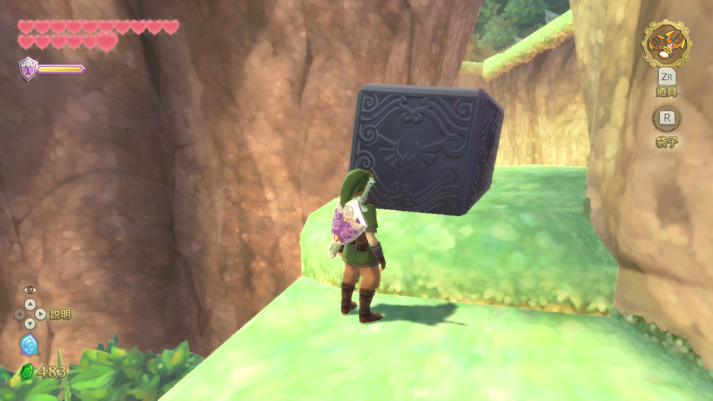
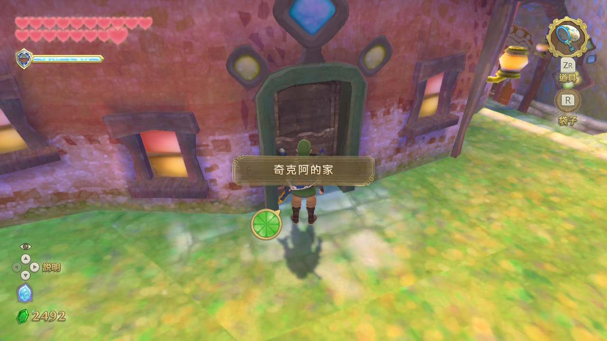
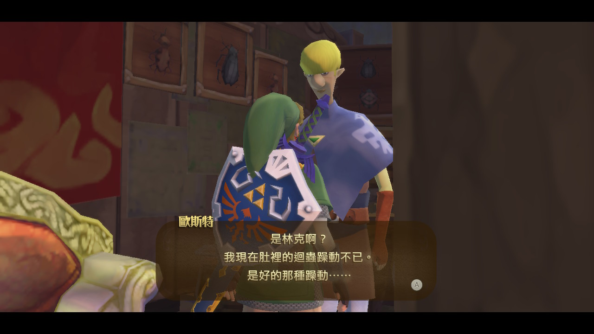
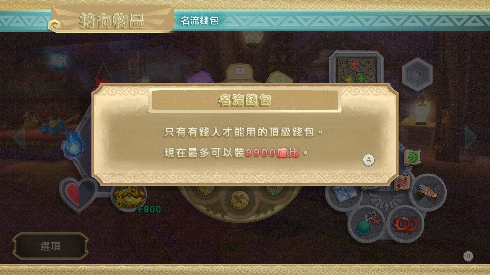

# 禦天之劍 100% 全收集

- [x] 100% complete both Normal and Hero Mode.

- [x] Activate all 27 Goddess Cubes and open their respective Goddess's Treasure Chests.
    - [x] Goddess Cube 1:
    
        - [x] Cube Location: Deep Woods
        - [x] Chest Location: Pumpkin Landing This chest appears on the side of the massive pumpkin building.
    - [x] Goddess Cube 2:
    
        - [x] Cube Location: Deep Woods.
        - [x] Chest Location: Small island south of Skyloft.
    - [x] Goddess Cube 3:
    
        - [x] Cube Location: Faron Woods Great Tree.
        - [x] Chest Location: This opens a chest on an island in the northern part of the Thunderhead.
    - [x] Goddess Cube 4:
    
        - [x] Cube Location: Faron Woods Great Tree.
        - [x] Chest Location: This opens a chest on the west side of Skyloft.
    - [x] Goddess Cube 5:
    
        - [x] Cube Location:Faron Woods Great Tree.
        - [x] Chest Location: Volcano shaped Island East and JUST south of the Lanayru portal.
    - [x] Goddess Cube 6:
    
        - [x] Cube Location: Skyview Temple Entrance.
        - [x] Chest Location: Beedle's Island.
    - [x] Goddess Cube 7:
    
        - [x] Cube Location: Skyview Spring.
        - [x] Chest Location: Pumpkin Landing, above the doorway.
    - [x] Goddess Cube 8:
    
        - [x] Cube Location: Under Lake Floria.
        - [x] Chest Location: You need the Clawshots to get to the chest on the east side of Skyloft.
    - [x] Goddess Cube 9:
    
        - [x] Cube Location: Ancient Cistern Entrance.
        - [x] Chest Location: On a small island under Fun-Fun Island.
    - [x] Goddess Cube 10:
    
        - [x] Cube Location: Eldin Volcano Entry.
        - [x] Chest Location: This opens a chest in the north of Skyloft, next to bamboo island.
    - [x] Goddess Cube 11:
    
        - [x] Cube Location: Eldin Volcano Entry.
        - [x] Chest Location: This opens a chest in the southwest of Skyloft, to the west of Fun Fun Island.
    - [x] Goddess Cube 12:
    
        - [x] Cube Location: Eldin Volcano.
        - [x] Chest Location: This opens a chest on the Isle of Songs in the Thunderhead.
    - [x] Goddess Cube 13:
    
        - [x] Cube Location: Earth Temple Entrance.
        - [x] Chest Location: This opens a chest on Bamboo Island.
    - [x] Goddess Cube 14:
    
        - [x] Cube Location: Earth Temple Entrance.
        - [x] Chest Location: This opens a chest in the northeast of Skyloft, southeast of Beedle's Island.
    - [x] Goddess Cube 15:
        
        - [x] Cube Location: Eastern Eldin Volcano.
        - [x] Chest Location: This opens a chest in center of the town of Skyloft.
    - [x] Goddess Cube 16:
    
        - [x] Cube Location: Fire Sanctuary Entrance.
        - [x] Chest Location: This chest is on Bug Island in the Thunderhead.
    - [x] Goddess Cube 17:
    
        - [x] Cube Location: Fire Sanctuary Entrance.
        - [x] Chest Location: On the roof of the Isle of Storms building in the Thunderhead.
    - [x] Goddess Cube 18:
    
        - [x] Cube Location: Fire Dragon's Domain.
        - [x] Chest Location: Land on the island in the western area of the Thunderhead. You can find a dig spot on one side of the island. One of the dig spot's exits leads to this Chest.
    - [x] Goddess Cube 19:
    
        - [x] Cube Location: Lanayru Mines Entrance.
        - [x] Chest Location: This opens a chest northwest of Skyloft, but you'll have to bomb a wall on the marked island to get to it.
    - [x] Goddess Cube 20:
    
        - [x] Cube Location: Lanayru Desert.
        - [x] Chest Location: South of Skyloft is a floating island with a hollowed-out volcano-like area.
    - [x] Goddess Cube 21:
    
        - [x] Cube Location: Temple of Time Entrance.
        - [x] Chest Location: The chest it opens is on Beedle's Island in the northeast of the sky.
    - [x] Goddess Cube 22:
    
        - [x] Cube Location: Lanayru Desert.
        - [x] Chest Location: An island between the Bamboo Island and Beedle's Island.
    - [x] Goddess Cube 23:
    
        - [x] Cube Location: Lanayru Mining Facility Entrance.
        - [x] Chest Location: An island northwest of Fun-Fun Island.
    - [x] Goddess Cube 24:
    
        - [x] Cube Location: Sand Sea Entrance.
        - [x] Chest Location: This opens a chest in the Bazaar in Skyloft.
    - [x] Goddess Cube 25:
    
        - [x] Cube Location: Skipper's Retreat.
        - [x] Chest Location: This opens a chest in the sky on an island to the far west of Skyloft.
    - [x] Goddess Cube 26:
    
        - [x] Cube Location: Pirate Hideout.
        - [x] Chest Location: This opens a chest on the east side of Skyloft.
    - [x] Goddess Cube 27:
    
        - [x] Cube Location: Tree of Life.
        - [x] Chest Location: Land on the island in the western area of the Thunderhead.
- [x] Activate all Bird Statues.
    - [x] Eldin Province (x6).
    
        - [x] Inside the Fire Sanctuary.
        - [x] Inside the Volcano.
        - [x] Temple Entrance.
        - [x] Volcano Ascent.
        - [x] Volcano East.
        - [x] Volcano Entry.
    - [x] Faron Province (x10).
    
        - [x] Behind the Temple.
        - [x] Deep Woods.
        - [x] Faron Woods Entry.
        - [x] Floria Waterfall.
        - [x] Forest Temple.
        - [x] Great Tree Top.
        - [x] In the Woods.
        - [x] Lake Floria.
        - [x] Sealed Grounds.
        - [x] Viewing Platform.
    - [x] Lanayru Province.
    
        - [x] Ancient Harbor.
        - [x] Desert Entrance.
        - [x] Desert Gorge.
        - [x] Lanayru Gorge.
        - [x] Lanayru Mine Entry.
        - [x] Lanayru Shipyard.
        - [x] North Desert.
        - [x] Pirate Stronghold.
        - [x] Skipper's Retreat.
        - [x] Stone Cache.
        - [x] Temple of Time.
        - [x] West Desert.
- [x] Activate all Goddess Walls.
    - [x] Ancient Cistern (x1):
        - [x] Western room with whirlpool.
        
    - [x] Faron Woods (x1):
        - [x] Outside Sealed Grounds shrine on the path to Faron Woods.
        
    - [x] Fire Sanctuary (x1):
        - [x] Once you land after jumping off the Bridge of Decision go up the stairs and look left. You will see the butterflies at the end of the hall.
        
    - [x] Sandship (x2):
        - [x] Floor B1, turn left from the first set of stairs leading down from 1F to face a wall, then turn left again to face the hallway. You will see butterflies down the hallway after the chandelier.
        
        - [x] While on the deck of the ship, after you have gone as high as you can on the Crow's Nests and begin making your descent, make your way to the back of the ship (head east on the map). When you're standing on the deck on the back of the ship, you'll see a mast with a clawshot target. If you follow the clawshots you'll find a platform with a Goddess Wall and a chest containing a Piece of Heart.
        
    - [x] Skyview Temple (x1):
        - [x] Just down stairs from the entrance.
        
- [x] Collect all 10 Medals.
    - [x] Bug Medal.
    
    - [x] Cursed Medal.
    
    - [x] Heart Medal (x2).
    
    - [x] Life Medal (x2).
    
    - [x] Potion Medal.
    
    - [x] Rupee Medal (x2).
    
    - [x] Treasure Medal.
    
- [x] Collect all five Empty Bottles.

    - [x] Empty Bottle 1:
        - [x] Location: Skyloft.
        
    - [x] Empty Bottle 2:
        - [x] Location: Sealed Grounds.
        
    - [x] Empty Bottle 3:
        - [x] Location: Island in the Sky.
        
    - [x] Empty Bottle 4:
        - [x] Location: Fire Sanctuary.
        
    - [x] Empty Bottle 5:
        - [x] Location: The Thunderhead.
        
- [x] Collect one of all 12 Bugs.
    - [x] Blessed Butterfly.
    
    - [x] Deku Hornet.
    
    - [x] Eldin Roller.
    
    - [x] Faron Grasshopper.
    
    - [x] Gerudo Dragonfly.
    
    - [x] Lanayru Ant.
    
    - [x] Sand Cicada.
    
    - [x] Sky Stag Beetle.
    
    - [x] Skyloft Mantis.
    
    - [x] Starry Firefly.
    
    - [x] Volcanic Ladybug.
    
    - [x] Woodland Rhino Beetle.
    
- [x] Collect one of all 16 Treasures.
    - [x] Amber Relic.
    
    - [x] Ancient Flower.
    
    - [x] Bird Feather.
    
    - [x] Blue Bird Feather.
    
    - [x] Dark Relic.
    
    - [x] Eldin Ore.
    
    - [x] Evil Crystal.
    
    - [x] Goddess Plume.
    
    - [x] Golden Skull.
    
    - [x] Hornet Larvae.
    
    - [x] Jelly Blob.
    
    - [x] Lizard Tail.
    
    - [x] Monster Claw.
    
    - [x] Monster Horn.
    
    - [x] Ornamental Skull.
    
    - [x] Tumbleweed.
    
- [x] Complete the Bug Wrangler course at Bug Rock.
- [x] Complete the Thunder Dragon's Lighting Round.
- [x] Enter each house in Skyloft once.
    - [x] Batreaux's house.
    
    - [x] Bertie's house.
    
    - [x] Gondo's house.
    
    - [x] Kukiel's house.
    
    - [x] Orielle & Parrow's house.
    
    - [x] Peatrice's house.
    
    - [x] Piper's house.
    
    - [x] Pipit's house.
    
    - [x] Rupin's house.
    
    - [x] Sparrot's house.
    
- [x] Extend the Life Gauge to 18 by collecting all six Heart Containers and all 24 Pieces of Heart.

- [x] Obtain the Hylian Shield.

- [x] Obtain the highest upgrades.
    - [x] Big Bug Net.
    
    - [x] Braced Shield.
    
    - [x] Fortified Shield.
    
    - [x] Goddess Shield.
    
    - [x] Large Bomb Bag.
    
    - [x] Large Quiver.
    
    - [x] Large Seed Satchel.
    
    - [x] Sacred Bow.
    
    - [x] Scattershot.
    
    - [x] Tough Beetle.
    
- [x] Reach over 28 hits in Clean Cut.

- [x] Speak to Rupin at night.

- [x] Speak to Strich at night.

- [x] Summon all Sheikah Stones.
    - [x] Sheikah Stone #1: Outside the Sealed Grounds.
    
    - [x] Sheikah Stone #2: Outside the Ancient Cistern.
    
    - [x] Sheikah Stone #3: On the Ledges near the Skyview Temple.
    
    - [x] Sheikah Stone #4: Left of the Lumpy Pumpkin at Pumpkin Island
    
    - [x] Sheikah Stone #5: Inside the House in Bamboo Island
    
    - [x] Sheikah Stone #6: West Side of the Thrill Digger Area
    
    - [x] Sheikah Stone #7: On the Ledge Left of the Earth Temple
    
    - [x] Sheikah Stone #8: Left of the Minecart in the Temple of Time.
    
    - [x] Sheikah Stone #9: On the Cave with the Second Frog Statue
    
    - [x] Sheikah Stone #10: In an Island Southeast of the Yellow Beam.
    
    - [x] Sheikah Stone #11: At the Center of the Lanayru Caves.
    
    - [x] Sheikah Stone #12: On the Narrow Path at the Lanayru Caves
    
    - [x] Sheikah Stone #13: At the Southeastern Lava Plates Area at the Eldin Volcano
    
    - [x] Sheikah Stone #14: On a Cave Southeast of the Earth Temple
    
    - [x] Sheikah Stone #15: On the Island South of Bug Rock
    
    - [x] Sheikah Stone #16: Reach the Top Ledge on the Waterfalls in Volcano Summit.
    
    - [x] Sheikah Stone #17: Use the Clawshots to Reach the Top of the Waterfall Island.
    
- [x] Unlock all five extra Dowsing targets.
    - [x] Goddess Cubes.
    
    - [x] Gratitude Crystals.
    
    - [x] Hearts.
    
    - [x] Rupees.
    
    - [x] Treasure.
    
- [x] Upgrade the Adventure Pouch capacity to 8.
- [x] Upgrade the Wallet capacity to 9,900 by collecting all 80 Gratitude Crystals.

